# Requirement 1 – QA/QC Job Market 2026+

### Job 1 – Quality Assurance Specialist

- Công ty: Poly & Bark
- Nền tảng: LinkedIn
- Link công việc: https://www.linkedin.com/jobs/view/4417332655/
- Ngày đăng: ~23/05/2026 (hiển thị “2 weeks ago” tính đến ngày 06/06/2026)
- Ảnh chụp có ngày: 06/06/2026
- Địa điểm: Thành phố Hồ Chí Minh, Việt Nam (Hybrid)
- Lương: Không công bố
- Yêu cầu kỹ năng AI/LLM/automation-AI: NO

#### Mô tả công việc

**Về Poly & Bark**  
Poly & Bark là một công ty nội thất hiện đại, chuyên cung cấp các sản phẩm phong cách, chất lượng cao, kết hợp giữa sự thoải mái, công năng và tính thẩm mỹ. Công ty làm việc trong một môi trường năng động, hợp tác nhằm hiện thực hóa các thiết kế truyền cảm hứng.

**Về vai trò này**  
Công ty đang tìm kiếm một Quality Assurance Specialist làm việc toàn thời gian tại Thành phố Hồ Chí Minh. Ứng viên sẽ thực hiện kiểm tra chất lượng, đảm bảo tuân thủ Good Manufacturing Practices và kiểm toán các quy trình vận hành nhằm duy trì tiêu chuẩn sản phẩm nhất quán — với hình thức làm việc linh hoạt một phần tại nhà.

**Trách nhiệm**

- Thực hiện kiểm tra chất lượng và kiểm toán trong các quy trình sản xuất
- Đảm bảo tuân thủ các quy trình quản lý chất lượng và tiêu chuẩn GMP
- Phát triển và cải tiến các framework kiểm toán nhằm duy trì tính nhất quán trong vận hành
- Đóng góp vào các sáng kiến cải tiến liên tục trong chức năng QA

#### Kỹ năng yêu cầu

- Hơn 5 năm kinh nghiệm trong lĩnh vực Furniture and Home Furnishings Manufacturing
- Hơn 5 năm kinh nghiệm làm việc với Upholster, Home Decor, Casegoods
- Có kinh nghiệm về Quality Control và Quality Assurance
- Hiểu biết về các nguyên tắc Quality Management và Good Manufacturing Practice (GMP)
- Thành thạo trong việc thực hiện quality audits và phát triển auditing frameworks
- Chú ý đến chi tiết và có kỹ năng giải quyết vấn đề tốt
- Có khả năng giao tiếp và viết báo cáo hiệu quả
- Có khả năng làm việc độc lập trong môi trường hybrid
- Có kinh nghiệm trong sản xuất nội thất hoặc ngành liên quan là một lợi thế
- Bằng cử nhân ngành Quality Management, Engineering hoặc lĩnh vực liên quan

#### Phân tích tác động của AI

AI không phải là kỹ năng cốt lõi trong vị trí này, nhưng có thể hỗ trợ QA Specialist tổng hợp dữ liệu kiểm toán, phát hiện xu hướng lỗi và chuẩn hóa báo cáo chất lượng trong sản xuất nội thất. Tuy vậy, trách nhiệm chính vẫn thuộc về con người vì việc đánh giá GMP, kiểm tra vật liệu/sản phẩm thực tế và quyết định cải tiến quy trình cần kinh nghiệm ngành, quan sát trực tiếp và phán đoán chuyên môn.

#### Ảnh chụp màn hình

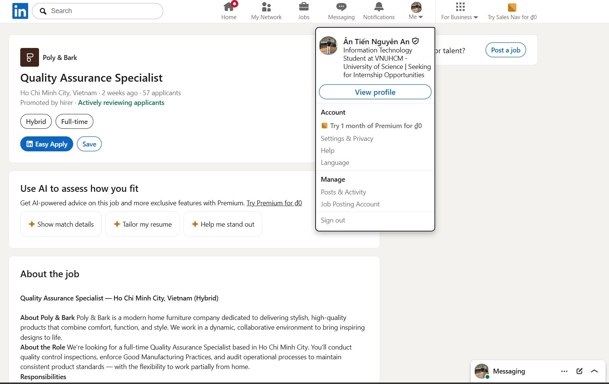
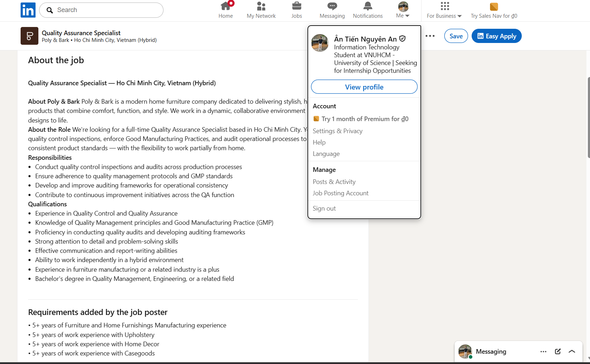

---

### Job 2 - Junior QA/QC Engineer

- Công ty: SQREEM Technologies
- Nền tảng: LinkedIn
- Link công việc: https://www.linkedin.com/jobs/view/4424542002/
- Ngày đăng: 06/06/2026 (hiển thị “16 hours ago” tính đến ngày 06/06/2026)
- Ảnh chụp có ngày: 06/06/2026
- Địa điểm: Thành phố Hồ Chí Minh, Việt Nam (Hybrid, Full-time)
- Lương: Không công bố
- Yêu cầu kỹ năng AI/LLM/automation-AI: NO

### Mô tả công việc

#### CHÚNG TÔI LÀ AI?

Tầm nhìn của SQREEM là chuyển đổi hành vi con người thành actionable intelligence.

SQREEM là một công ty Cognitive AI hàng đầu, chuyên cung cấp Behavioral Intelligence — một phương pháp mang tính chuyển đổi trong việc hiểu, lập bản đồ và dự đoán hành vi con người.

Bằng cách sử dụng mô hình Cognitive AI độc quyền, công ty xử lý hơn 4 tỷ tín hiệu dữ liệu không liên quan và phi cấu trúc mỗi ngày từ Open Web trên hơn 70 quốc gia. Thông qua việc giải mã các mẫu hành vi, phát hiện ý định và phân tích hành vi, SQREEM chuyển đổi các tập dữ liệu lớn và phức tạp thành actionable intelligence để doanh nghiệp có thể đưa ra quyết định thông minh và chính xác hơn.

Công nghệ đổi mới của công ty vận hành ONE platform, một nền tảng end-to-end độc quyền, cho phép các tổ chức chuyển đổi những hành vi phức tạp thành các insight rõ ràng dựa trên dữ liệu. Từ việc hiểu ý định của audience đến xây dựng các segment được tinh chỉnh cao, ONE thu hẹp khoảng cách giữa dữ liệu và quá trình ra quyết định, giúp doanh nghiệp mở khóa khả năng tương tác có ý nghĩa ở quy mô lớn.

Kết quả là thư viện lớn nhất thế giới về các tín hiệu intent và demographic theo hướng privacy-first, non-PII, GDPR-compliant, bao gồm các ID-free cohorts đáp ứng các tiêu chuẩn toàn cầu cao nhất về quyền riêng tư và bảo mật như HIPAA, COPPA, GDPR và ISO-27001.

Để tiếp cận nhóm audience dưới 18 tuổi, nền tảng TotallyAwesome là một giải pháp marketing theo hướng contextual-first, giúp tăng hiệu quả quảng cáo mà không sử dụng dữ liệu cá nhân và đảm bảo 100% brand safety. Bằng cách kết hợp human moderation, AI và chuyên môn tâm lý học, công ty phân phối đúng nội dung đến đúng audience vào đúng thời điểm. Các giải pháp multi-channel của công ty tiếp cận hơn 600 triệu người dùng hàng tháng tại APAC trên apps, sites, YouTube, gaming và influencers.

#### BẠN SẼ LÀM GÌ?

**Bạn sẽ đóng góp cho team như thế nào?**

- Thực hiện manual testing cho web applications và mobile applications từ đầu đến cuối
- Thực hiện API testing khi được yêu cầu
- Tạo và thực thi test plans và test cases chi tiết
- Xác định, ghi nhận và theo dõi defects
- Phối hợp với developers để đảm bảo issues được xử lý kịp thời
- Chủ động xác định các vấn đề tiềm ẩn và đề xuất giải pháp
- Phát triển và thực thi automated test scripts nhằm cải thiện hiệu quả kiểm thử

#### CHÚNG TÔI ĐANG TÌM KIẾM AI?

- Bằng cử nhân ngành Computer Science hoặc lĩnh vực liên quan
- Ít nhất 1 năm kinh nghiệm kiểm thử Web UI và Mobile application
- Hiểu biết về software testing methodologies, processes và best practices
- Có kiến thức cơ bản về ngôn ngữ lập trình như Java hoặc Python
- Có kiến thức cơ bản về SQL và database testing
- Có kinh nghiệm với API testing tools như Postman hoặc Swagger là một lợi thế
- Có kinh nghiệm với automation testing tools như Selenium, Appium hoặc Robot Framework là một lợi thế
- Có kinh nghiệm Performance hoặc Security testing là một lợi thế
- Quen thuộc với Android và iOS testing là một lợi thế
- Có động lực cao, chủ động và có tinh thần làm việc tốt
- Có kỹ năng phân tích và giải quyết vấn đề xuất sắc
- Có kỹ năng giao tiếp và làm việc nhóm tốt
- Có khả năng nói và viết tiếng Anh tốt

#### VĂN HÓA LÀM VIỆC CỦA CHÚNG TÔI

Công ty làm việc cùng nhau để giúp mọi người có khả năng chia sẻ câu chuyện của mình, khám phá điều họ yêu thích và kết nối với nhau trong quá trình đó. Trong văn hóa của công ty, các giá trị sau được đề cao:

- Innovation & Agility
- Teamwork & Collaboration
- Data Integrity & Ethics
- Results driven performance
- Human by design

Con người là trung tâm trong những gì công ty làm và là động lực thúc đẩy sự tăng trưởng cũng như thành công. Công ty xem văn hóa là huyết mạch của doanh nghiệp và nỗ lực duy trì điều này mỗi ngày khi tiếp tục phát triển và mở rộng team. Công ty tin vào việc mang đến cơ hội học hỏi và phát triển mỗi ngày, đồng thời có thành tích tốt trong việc phát triển nhân sự.

Công ty tự hào là một môi trường làm việc bình đẳng về cơ hội. Công ty xem xét hồ sơ ứng tuyển mà không phân biệt chủng tộc, màu da, tôn giáo, bản dạng giới, nguồn gốc quốc gia, quốc tịch, tuổi tác và tình trạng hôn nhân.

#### PHẨM CHẤT CÁ NHÂN

- Bạn là người chủ động, độc lập và có khả năng giải quyết vấn đề. Bạn xem mình là người có hiệu suất làm việc cao
- Hiểu ý nghĩa của việc mang lại sự xuất sắc
- Có khiếu hài hước và khả năng giữ bình tĩnh dưới áp lực
- Có tổ chức tốt, kỹ năng giao tiếp và quản lý thời gian xuất sắc

#### CHÚNG TÔI CÓ THỂ MANG LẠI GÌ CHO BẠN

- Môi trường làm việc xã hội
- Hình thức làm việc linh hoạt
- Chương trình mentorship
- Hỗ trợ làm việc từ xa trên nhiều thị trường
- Công ty là một team gồm các chuyên gia đam mê. Công ty không chỉ dẫn đầu ngành này mà còn đang định hình ngành này.

Vui lòng gửi CV bằng tiếng Anh đến careers@sqreem.com

### Kỹ năng yêu cầu

- Bằng cử nhân ngành Computer Science hoặc lĩnh vực liên quan

- Ít nhất 1 năm kinh nghiệm kiểm thử Web UI và Mobile application

- Hiểu biết về software testing methodologies, processes và best practices

- Kiến thức cơ bản về ngôn ngữ lập trình như Java hoặc Python

- Kiến thức cơ bản về SQL và database testing

- Kinh nghiệm với API testing tools như Postman hoặc Swagger — plus

- Kinh nghiệm với automation testing tools như Selenium, Appium hoặc Robot Framework — plus

- Kinh nghiệm với Performance hoặc Security testing — plus

- Quen thuộc với Android và iOS testing — advantage

- Kỹ năng phân tích, giao tiếp và tiếng Anh tốt, bao gồm viết và nói

#### Phân tích tác động của AI

Dù công ty hoạt động trong lĩnh vực Cognitive AI, vị trí Junior QA/QC Engineer này vẫn tập trung vào manual testing, API testing, test case design và defect tracking, nên AI chủ yếu đóng vai trò công cụ hỗ trợ tạo test cases, phân tích log hoặc gợi ý phạm vi regression. Người QA vẫn cần tự xác nhận hành vi web/mobile, đánh giá defect theo ngữ cảnh sản phẩm và phối hợp với developer để xử lý lỗi đúng mức ưu tiên.

#### Ảnh chụp màn hình

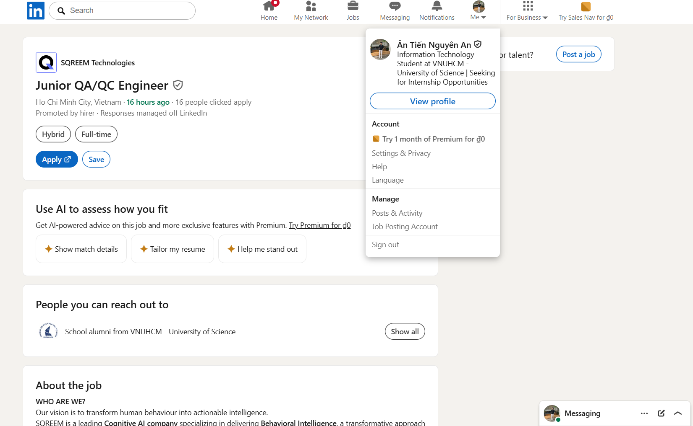
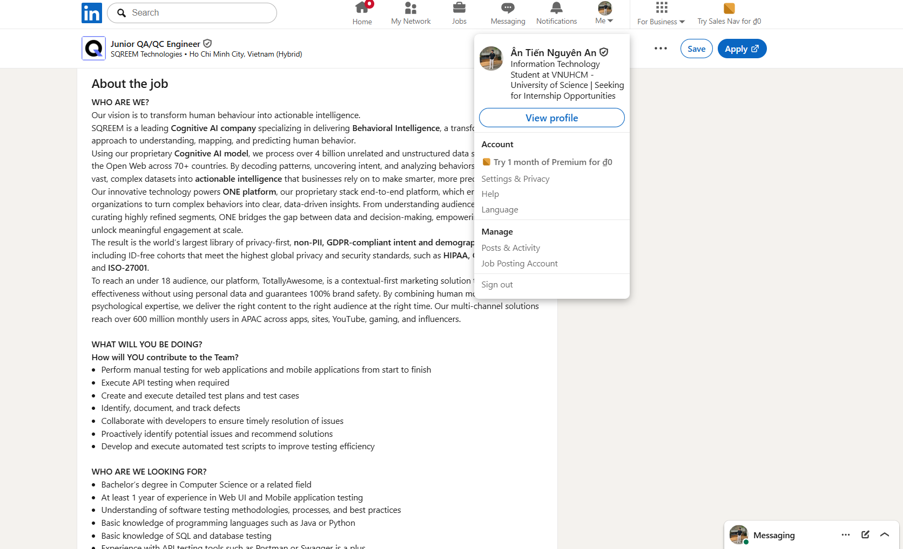
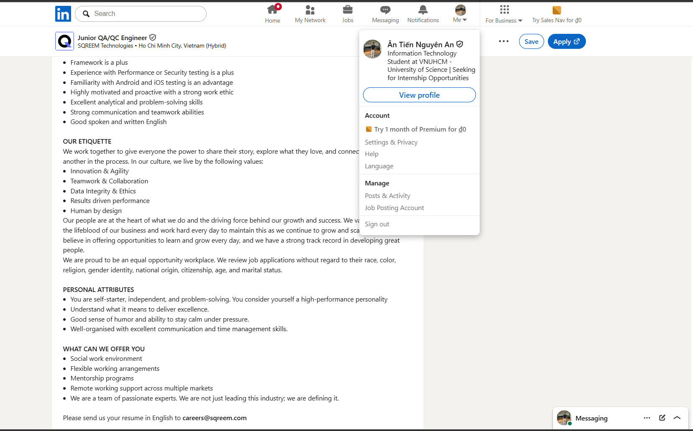

---

### Job 3 – Junior QA Engineer

- Công ty: DXC Technology (NYSE: DXC)
- Nền tảng: LinkedIn
- Link công việc: https://www.linkedin.com/jobs/view/4394431613/
- Ngày đăng: ~23/05/2026 (“Reposted 2 weeks ago” tính đến ngày 06/06/2026)
- Ảnh chụp có ngày: 06/06/2026
- Địa điểm: Thành phố Hồ Chí Minh, Việt Nam (Full-time)
- Lương: Không công bố. Phúc lợi bao gồm 13th-month salary guaranteed, đầy đủ social/health/unemployment insurance, premium healthcare 1+1, 12 ngày annual leave + 6 ngày personal days
- Yêu cầu kỹ năng AI/LLM/automation-AI: NO

#### Mô tả công việc

DXC Technology là một đối tác công nghệ doanh nghiệp toàn cầu, hỗ trợ các tổ chức khai thác AI để hiện đại hóa infrastructure, applications và các giải pháp chuyên biệt theo ngành. Junior QA Engineer (Manual + Automation) sẽ làm việc trong môi trường Agile/Scrum, phụ trách toàn bộ defect lifecycle trong Jira và duy trì automated test scripts bằng Katalon Studio và/hoặc TestComplete.

**Trách nhiệm:**

- Phân tích business requirements và tạo test plans, test cases, test scenarios chi tiết

- Thực hiện manual testing bao gồm functional, regression, smoke và UAT cho web và mobile applications

- Ghi nhận, theo dõi và quản lý defects trong Jira với các bước tái hiện rõ ràng và mức độ ưu tiên phù hợp

- Phối hợp với developers, BAs và Product Owners trong môi trường Agile/Scrum

- Duy trì và thực thi automated test scripts bằng Katalon Studio và/hoặc TestComplete; cập nhật object repositories và tạo reusable keywords/functions

- Thực hiện API testing cơ bản bằng Postman hoặc Katalon (REST)

- Đóng góp vào việc cải tiến liên tục QA processes, documentation và test data management

#### Kỹ năng yêu cầu

**Must-have:**

- Hơn 1 năm kinh nghiệm QA testing với nền tảng manual testing tốt, bao gồm functional, regression, integration

- Hiểu rõ SDLC/STLC và QA best practices

- Có kinh nghiệm thực hành automation: Katalon Studio (Groovy/Java) và/hoặc TestComplete (JavaScript/VBScript/Python)

- API testing với Postman/REST; kiến thức SQL cơ bản là một lợi thế

- Trình độ tiếng Anh Intermediate; giao tiếp và làm việc nhóm tốt

**Nice to have:**

- Git, Jenkins hoặc Azure DevOps

- Test management tools: Xray, Zephyr

#### Phân tích tác động của AI

Với vai trò Junior QA Engineer kết hợp manual và automation, AI có thể hỗ trợ viết test scenarios từ business requirements, tạo dữ liệu kiểm thử và phân tích lỗi trong Jira hoặc automation scripts. Tuy nhiên, công việc vẫn cần QA tự hiểu nghiệp vụ, xác định coverage cho functional/regression/UAT và kiểm soát chất lượng script Katalon/TestComplete thay vì phụ thuộc hoàn toàn vào gợi ý tự động.

#### Ảnh chụp màn hình

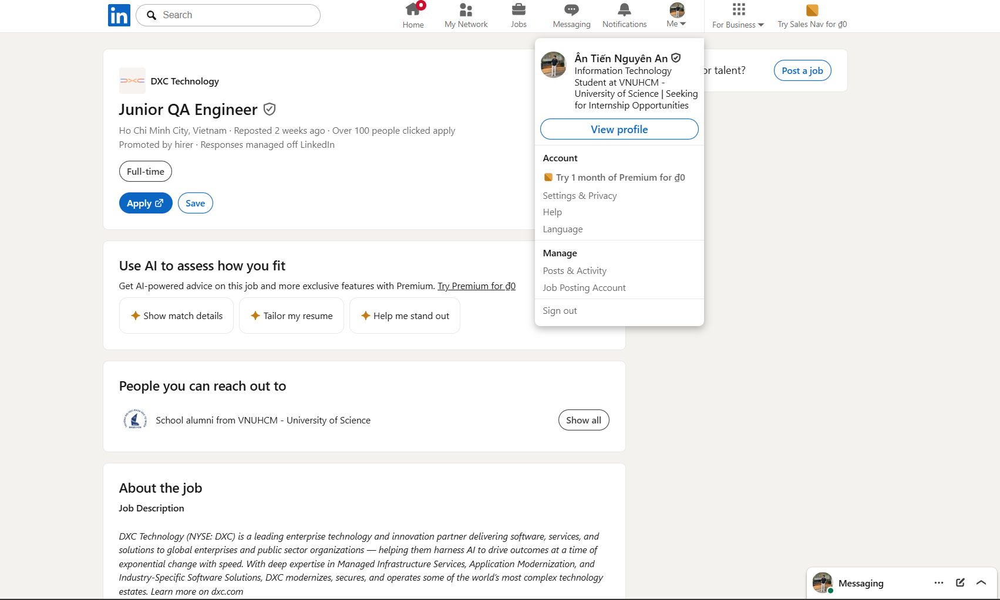
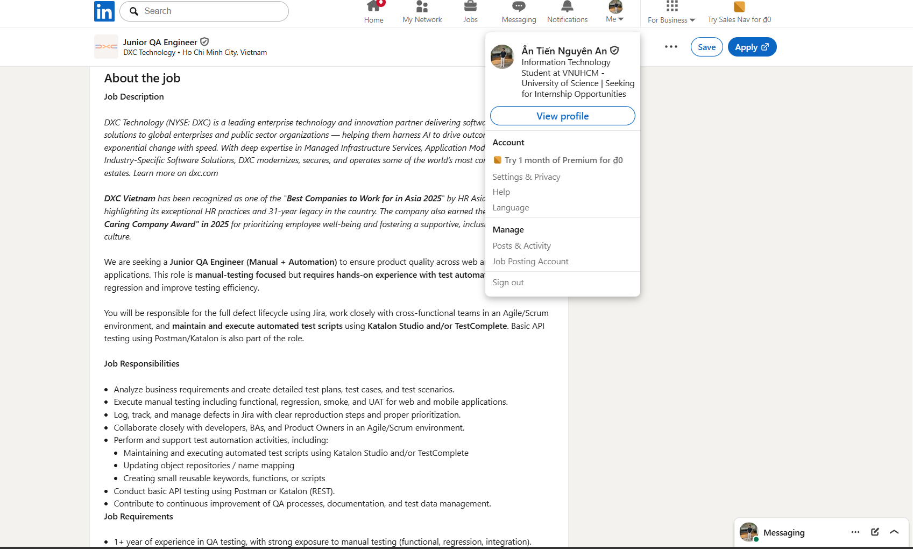
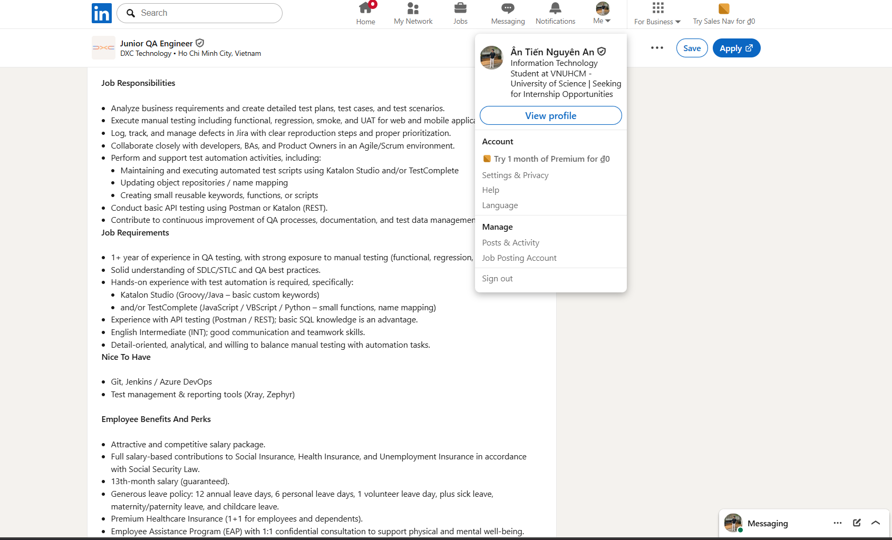
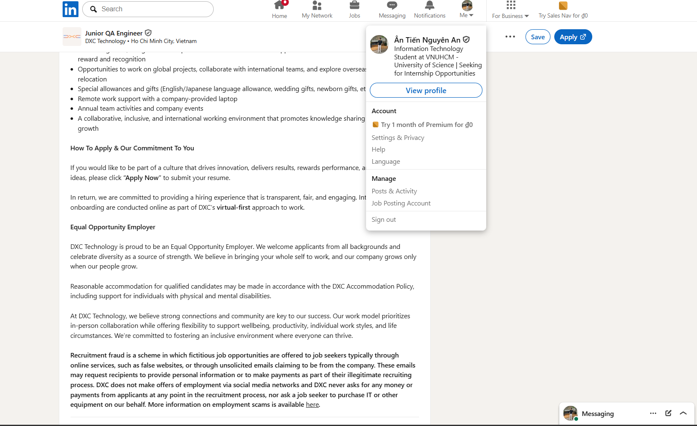

---

### Job 4 – Quality Control Engineer

- Công ty: DXC Technology (NYSE: DXC)
- Nền tảng: LinkedIn
- Link công việc: https://www.linkedin.com/jobs/view/4410294847/
- Ngày đăng: 03/06/2026 (“Reposted 3 days ago” tính đến ngày 06/06/2026)
- Ảnh chụp có ngày: 06/06/2026
- Địa điểm: Thành phố Hồ Chí Minh, Việt Nam (Hybrid, Full-time)
- Lương: Không công bố. Phúc lợi bao gồm 13th-month salary guaranteed, đầy đủ social/health/unemployment insurance, premium healthcare 1+1, 12 ngày annual leave + 6 ngày personal days
- Yêu cầu kỹ năng AI/LLM/automation-AI: NO

#### Mô tả công việc

**Tóm tắt công việc:**

Đây là một vị trí Quality Control Engineer dành cho những ứng viên quan tâm đến việc phát triển và thực thi exploratory tests và automated tests nhằm đảm bảo chất lượng sản phẩm tốt hơn. Ứng viên sẽ chịu trách nhiệm phát triển và triển khai tests, debug và xác định corrective actions. Ứng viên cũng sẽ review system requirements và theo dõi quality assurance metrics, ví dụ như defect densities và open defect counts.

**Trách nhiệm công việc**

- Thiết kế và phát triển tests, làm việc với các thành viên trong team để hiểu business needs
- Thiết kế, viết automation test script và thực thi testing
- Làm việc trong team để xác định risks và tạo tests nhằm giảm thiểu risks
- Tập trung nâng cao kỹ năng testing, bao gồm corner cases
- Chịu trách nhiệm cho tasks và story completion của mình
- Phân tích requirements về khả năng testability, chỉ ra gaps và potential pitfalls
- Thông báo issues ngay khi phát hiện cho team để đảm bảo các vấn đề được chú ý và xử lý phù hợp
- Làm việc với team để troubleshoot/xác định resolution cho các vấn đề đơn giản trong domain của team
- Hỗ trợ phát triển physical và functional test requirements để đảm bảo specifications & regulations được đáp ứng
- Báo cáo trực tiếp cho PM/QC lead trong account

#### Kỹ năng yêu cầu

**Must-have:**

- Bằng cử nhân hoặc cao hơn trong ngành Computer Science, Information Technology hoặc lĩnh vực liên quan

- Tối thiểu 1 năm kinh nghiệm trong software testing

- Có kiến thức về ít nhất một ngôn ngữ lập trình như Java, Python, v.v.

- Có kinh nghiệm với HTML và CSS

- Có khả năng viết test documentation rõ ràng và súc tích

- Kỹ năng giao tiếp tiếng Anh, phối hợp và làm việc nhóm tốt

**Nice to have:**

- Kiến thức về CI/CD pipelines

- Kinh nghiệm với Agile development methodologies

#### Phân tích tác động của AI

AI có thể hỗ trợ Quality Control Engineer trong việc gợi ý corner cases, phân tích defect metrics như defect density/open defect count và hỗ trợ review yêu cầu về testability. Tuy nhiên, vị trí này không yêu cầu AI trực tiếp, nên năng lực quan trọng vẫn là thiết kế exploratory/automated tests, đánh giá risk, giao tiếp issue sớm và đưa ra corrective actions dựa trên hiểu biết domain của team.

#### Ảnh chụp màn hình

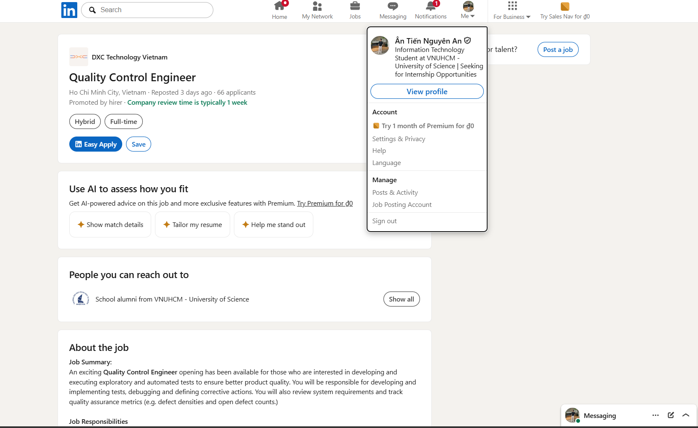
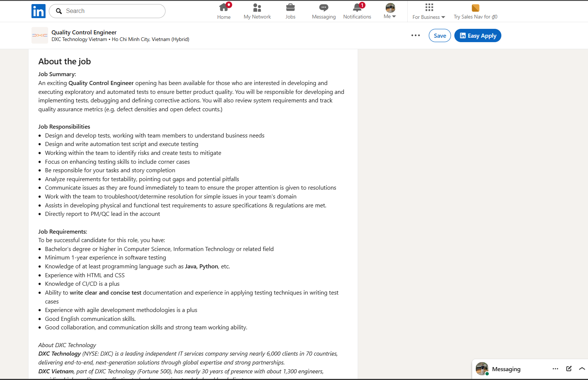
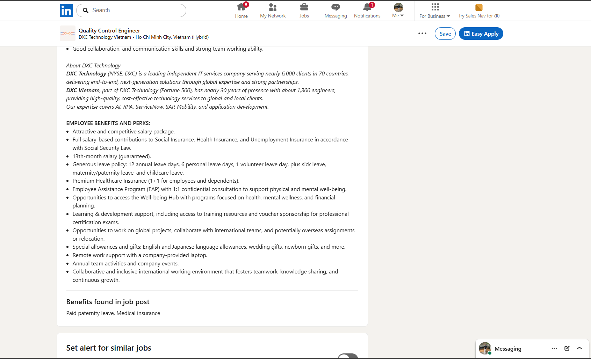

---

### Job 5 – QA Engineer (AI Testing)

- Công ty: SCC Vietnam (Specialist Computer Centers Ltd. — hoạt động tại hơn 50 quốc gia)
- Nền tảng: LinkedIn
- Link công việc: https://www.linkedin.com/jobs/view/4420283653/
- Ngày đăng: ~30/05/2026 (“1 week ago” tính đến ngày 06/06/2026)
- Ảnh chụp có ngày: 06/06/2026
- Địa điểm: Khu vực Thành phố Hồ Chí Minh, Việt Nam (Hybrid, Full-time)
- Lương: Không công bố. Phúc lợi gồm Performance Bonus, 13th Salary, healthcare toàn diện bao gồm Accident 24/24, Inpatient, Outpatient, Dental + Dependents, Annual Health Check, Company Trip
- Yêu cầu kỹ năng AI/LLM/automation-AI: YES

#### Mô tả công việc

Công ty đang tìm kiếm một AI QC để tham gia vào hoạt động kinh doanh đang phát triển tại văn phòng Thành phố Hồ Chí Minh. Báo cáo trực tiếp cho Test Lead, vai trò này mang đến cơ hội tốt để hỗ trợ doanh nghiệp và nâng cao năng lực testing. Nhiệm vụ bao gồm Manual/Automated Testing, được sử dụng để hỗ trợ và nâng cao hoạt động testing. Trong vai trò này, QC sẽ làm việc chặt chẽ với nhiều stakeholders khác nhau trong doanh nghiệp và trong dự án.

**QC chịu trách nhiệm phát triển Test Scripts và Test Data** cho applications nhằm đảm bảo chất lượng, độ tin cậy và sự tuân thủ của Scout — một AI-powered agent cho sales teams — bằng cách xác thực một cách có hệ thống các khía cạnh như data consolidation, conversational accuracy, meeting preparation outputs và strategic insights trong Microsoft Teams.

**Nhiệm vụ chính của công việc:**

- Hỗ trợ Test Lead review và hỗ trợ documentation do testing team tạo ra, bao gồm Test Quality Matrix, Test Entry/Exit criteria, daily reporting và test completion reports

- Làm việc với UK Team, thực hiện SIT, FAT cho Project Team

- Functional Testing
  - Xác thực chat-based AI interactions và structured account insights về độ chính xác, rõ ràng và đầy đủ.

  - Kiểm thử data consolidation từ ZoomInfo, Sales Hub (CRM) và public web sources thông qua Knowledge Graph.

  - Đánh giá meeting preparation outputs, bao gồm summaries, stakeholder profiles, signals và talking points.

  - Xác minh role play simulations cho stakeholder conversations.

- Source Priority & Conflict Logic
  - Kiểm tra conflict resolution rules được áp dụng đúng, bao gồm priority, recency và confidence thresholds.

  - Đảm bảo outputs bao gồm conflict resolution log minh bạch theo yêu cầu EU AI Act compliance.

- Compliance and Auditability
  - Xác minh các yêu cầu về transparency, human oversight và accuracy của Scout.

  - Xác nhận logging và source attribution tuân thủ EU AI Act và group policy.

- Adapter & Scalability Testing

- Kiểm thử data adapters cho authentication, field mapping, normalization và error handling.
  - Xác thực integration trên nhiều markets và data sources khác nhau.

- Bug Reporting & Iteration
  - Ghi nhận test results, defects và improvement recommendations.

  - Phối hợp với developers, architects và project stakeholders để hỗ trợ agile delivery.

- Phân tích và diễn giải Business Requirements

- Review và chấp nhận project plans khi bắt đầu dự án, đồng thời xác định milestones và estimated hours cho việc viết test cases và testing

- Thể hiện khả năng thiết kế test cases hiệu quả, phân tích và cung cấp reporting về test results

- Cung cấp testing progress reports và đảm bảo các vấn đề tiềm ẩn được nêu ra

- Đảm bảo project deadlines được đáp ứng thông qua việc quản lý chủ động testing tasks

- Tham gia defect review và các cuộc họp liên quan đến dự án

- Duy trì mối quan hệ làm việc chủ động và tích cực với các thành viên khác trong project team

- Đóng góp vào daily scrum, planning, estimation và retrospective sessions

#### Kỹ năng yêu cầu

**Must-have:**

- Bằng cử nhân ngành Computer Science, Engineering, Information Systems hoặc tương đương

- 2–4 năm kinh nghiệm trong software hoặc AI testing, bao gồm manual và automated

- Quen thuộc với Microsoft Teams, Azure AI/Cloud stack, CRM platforms như Sales Hub, Salesforce và public data sources

- Có kinh nghiệm testing conversational interfaces, data pipelines hoặc AI-powered applications

- Hiểu AI conflict resolution, data governance và compliance frameworks như EU AI Act

- Có kinh nghiệm SIT/FAT/coordination và hiểu sâu về testing lifecycle

- Có kinh nghiệm Agile Methodology; kỹ năng stakeholder và customer management tốt

**Nice to have:**

- Kinh nghiệm làm việc trong môi trường onshore/offshore

- Kiến thức về release và project management

#### Phân tích tác động của AI

AI tác động trực tiếp đến vai trò này vì QC phải kiểm thử một AI-powered sales agent, bao gồm conversational accuracy, data consolidation, conflict logic, source attribution và yêu cầu EU AI Act compliance. Vì vậy kỹ năng quan trọng không chỉ là manual/automation testing mà còn là đánh giá đầu ra AI, thiết kế test data cho nhiều nguồn dữ liệu, kiểm tra audit log và đảm bảo human oversight trước khi chấp nhận chất lượng.

#### Ảnh chụp màn hình

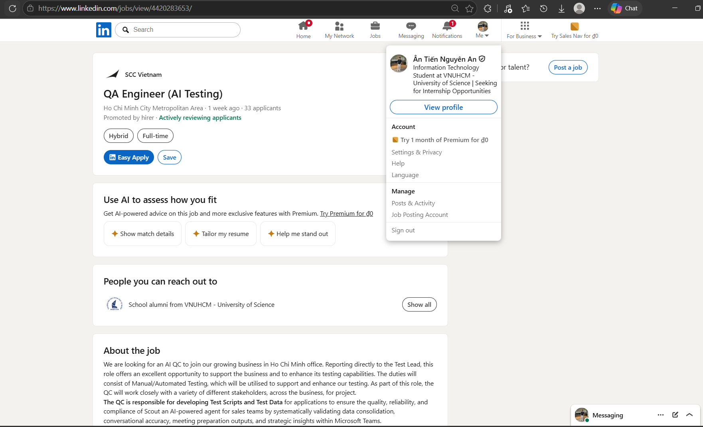
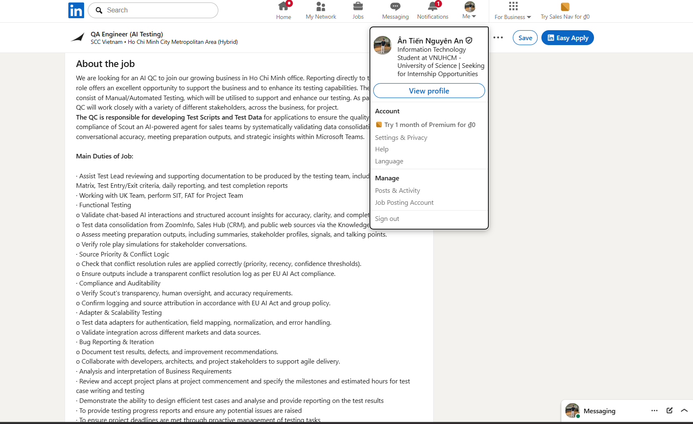
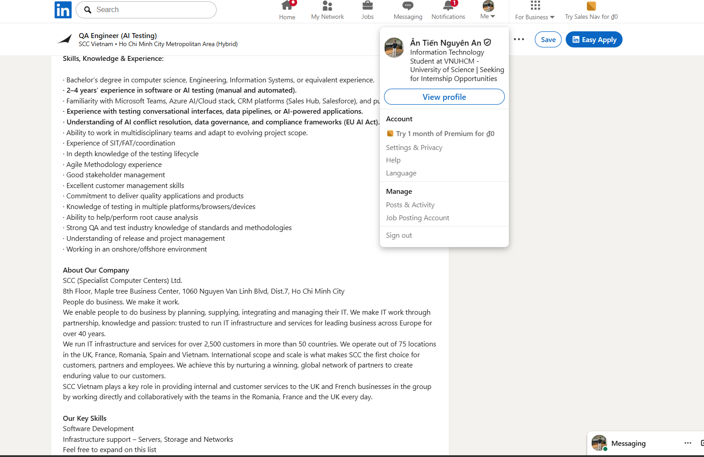
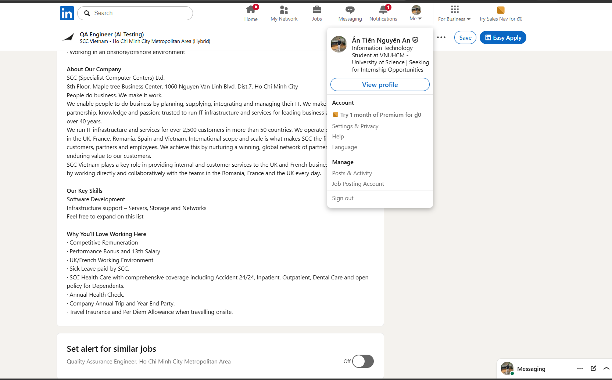

---

### Job 6 – Quality Engineer

- Công ty: ZaloPay, nền tảng thanh toán số hàng đầu Việt Nam
- Nền tảng: LinkedIn
- Link công việc: https://www.linkedin.com/jobs/view/4409679195
- Ngày đăng: ~06/05/2026 (“1 month ago” tính đến ngày 06/06/2026)
- Ảnh chụp có ngày: 06/06/2026
- Địa điểm: Thành phố Hồ Chí Minh, Việt Nam (On-site, Full-time)
- Lương: Không công bố
- Yêu cầu kỹ năng AI/LLM/automation-AI: YES

#### Mô tả công việc

**Mô tả:**

- Thiết kế và phát triển automated test scripts dựa trên test cases và requirements.
- Thường xuyên cập nhật và bảo trì test scripts để đảm bảo chúng vẫn hiệu quả khi application thay đổi.
- Chạy automated tests và phân tích kết quả để đảm bảo software đáp ứng quality standards.
- Xác định, ghi nhận và theo dõi defects phát hiện trong quá trình testing, đồng thời phối hợp với developers để xử lý.
- Tài liệu hóa test plans, test cases và results nhằm đảm bảo coverage và traceability đầy đủ.
- Xác định các cơ hội cải thiện hiệu quả và hiệu suất của test automation process.
- Review requirements, specifications và technical design documents.
- Đảm bảo các validated deliverables đáp ứng functional và design specifications cũng như requirements.
- Cập nhật các testing tools và test strategies mới.

#### Kỹ năng yêu cầu

- Bằng cử nhân ngành Computer Science, Engineering hoặc lĩnh vực liên quan.
- Hơn 2 năm kinh nghiệm thực hành ở vai trò QE.
- Có kinh nghiệm với test automation frameworks như Selenium, Playwright, Appium hoặc tương tự.
- Có kinh nghiệm với các công cụ như JMeter, Postman là một lợi thế.
- Có kinh nghiệm viết test cases mới dựa trên requirements.
- Integration Test và phát triển test cases, test plan.
- Hiểu biết tốt về software development methodologies.
- Có kinh nghiệm áp dụng test techniques trong dự án.
- Viết test cases và báo cáo bugs rõ ràng.
- Có kinh nghiệm với Agile/Scrum development process.
- Quen thuộc với bug tracker như Jira, TestRail...
- Sử dụng AI để cải thiện hiệu quả công việc.

#### Phân tích tác động của AI

Ở vị trí Quality Engineer của ZaloPay, AI được nêu như công cụ cải thiện hiệu quả công việc, đặc biệt trong việc gợi ý test cases, tối ưu automation scripts, phân tích kết quả test và nhận diện khu vực cần regression. Tuy nhiên, trong sản phẩm thanh toán số, QA vẫn phải chịu trách nhiệm cuối cùng về coverage, traceability, defect triage và xác nhận deliverables đáp ứng functional/design requirements.

#### Ảnh chụp màn hình

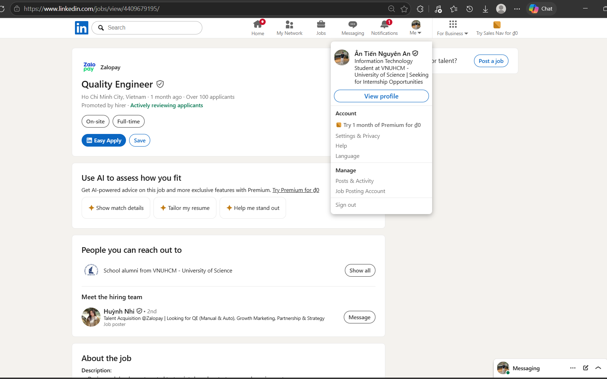
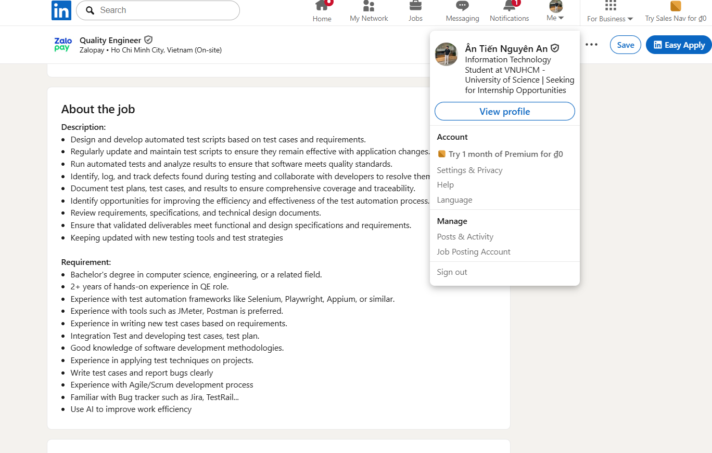

---

### Job 7 – Senior QA Engineer (AI-Augmented Quality Engineering)

- Công ty: Ins Enco
- Nền tảng: LinkedIn
- Link công việc: https://www.linkedin.com/jobs/view/4418876195/
- Ngày đăng: ~01/06/2026 (“Reposted 5 days ago” tính đến ngày 06/06/2026)
- Ảnh chụp có ngày: 06/06/2026
- Địa điểm: Thành phố Hồ Chí Minh, Việt Nam — Vinhomes Grand Park, Long Bình, Thủ Đức (On-site, Full-time)
- Lương: 30.000.000 – 40.000.000 VND gross/tháng, tùy theo kinh nghiệm + performance-based bonuses + dedicated AI tools & learning budget
- Yêu cầu kỹ năng AI/LLM/automation-AI: YES

#### Mô tả công việc

Công ty đang tìm kiếm một Senior QA Engineer để trở thành trụ cột chất lượng cốt lõi trong engineering team.

Đây là một vai trò full-cycle quality engineering — kết hợp test strategy, automation, CI/CD integration và AI-powered tooling để không chỉ phát hiện defects mà còn ngăn ngừa defects ở quy mô lớn.

**Trách nhiệm chính**

**Test Strategy & Quality Design**

- Thiết kế và duy trì test strategies trên các lớp manual, automated và AI-assisted

- Thúc đẩy shift-left testing bằng cách xác thực requirements và designs từ sớm

- Viết test cases rõ ràng, có thể tái hiện, phù hợp với user stories và acceptance criteria

- Thực hiện exploratory, risk-based và session-based testing

**Automation Engineering**

- Xây dựng và duy trì E2E test suites bằng Playwright

- Phát triển API test collections bằng Postman / Bruno

- Tích hợp automated tests vào CI/CD pipelines như GitHub Actions / Jenkins

- Triển khai AI self-healing frameworks như Mabl, Testim

- Thiết lập visual regression pipelines như Applitools, Percy

**AI-Augmented QA**

- Sử dụng GPT / Claude để tạo test cases, edge cases và test data

- Phân tích failure logs và xác định root causes bằng AI tools

- Tận dụng Postbot (Postman AI) để tự động tạo API tests

- Liên tục đánh giá và áp dụng các AI testing tools mới

**Quality Ownership**

- Theo dõi production quality bằng Sentry / Datadog

- Tham gia sprint ceremonies như planning, reviews, retrospectives

- Tạo test reports và truyền đạt quality metrics

- Thực hiện performance baseline testing bằng k6 / Lighthouse CI

#### Kỹ năng yêu cầu

**Must-Have**

- 3–6 năm kinh nghiệm trong QA / Quality Engineering

- Kinh nghiệm thực hành mạnh với Playwright, bao gồm E2E automation, CI integration, tracing

- Kinh nghiệm API testing vững chắc với Postman / Bruno, REST & GraphQL

- Kinh nghiệm với SQL / database validation

- Thành thạo Git và CI/CD pipelines như GitHub Actions hoặc tương tự

- Có kinh nghiệm làm việc với Jira + Xray/Zephyr

- Hiểu rõ Agile development processes

**AI-Essential, yêu cầu cho ứng viên vào final-stage**

- Có kinh nghiệm thực hành sử dụng GPT / Claude cho test generation và analysis

- Quen thuộc với AI-driven testing tools như Mabl, Testim

- Có kinh nghiệm với visual AI testing như Applitools / Percy

- Có tiếp xúc với Postbot / AI-generated API testing workflows

**Nice to Have**

- Performance testing tools như k6, Artillery

- Security testing như OWASP ZAP, Snyk

- Observability tools như Sentry, Datadog

- ISTQB certification, AI testing module là một lợi thế

#### Phân tích tác động của AI

AI là một phần thiết yếu của vai trò Senior QA Engineer này vì công việc yêu cầu dùng GPT/Claude, AI self-healing frameworks, visual AI testing và Postbot để mở rộng test generation, failure analysis, API testing và visual regression. Tác động chính là QA chuyển từ chỉ viết và chạy test sang thiết kế chiến lược kiểm thử có AI hỗ trợ, đồng thời vẫn phải kiểm soát risk-based testing, quality metrics và quyết định chất lượng cuối cùng.

#### Ảnh chụp màn hình

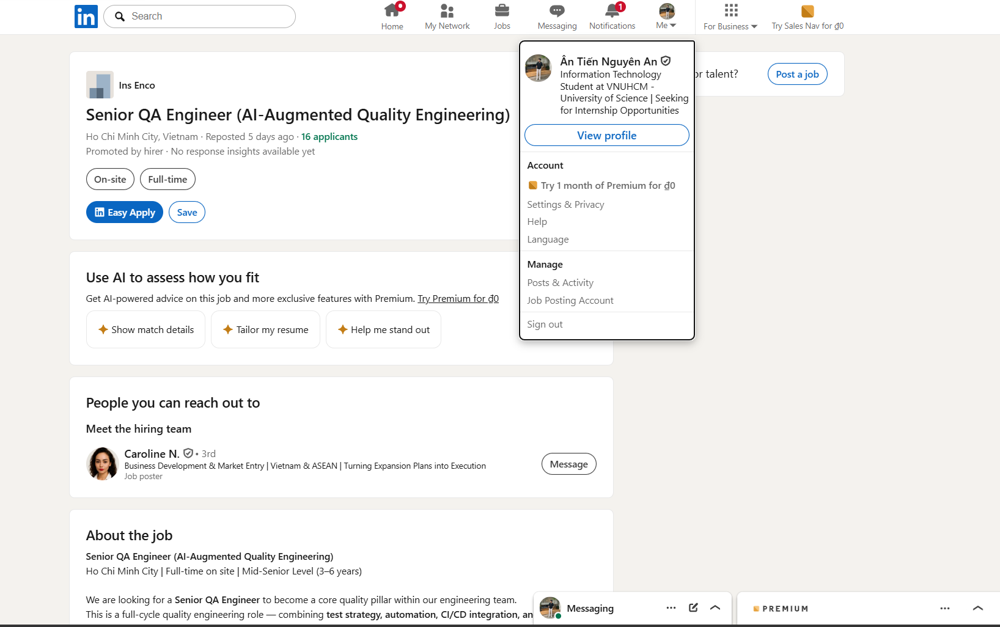
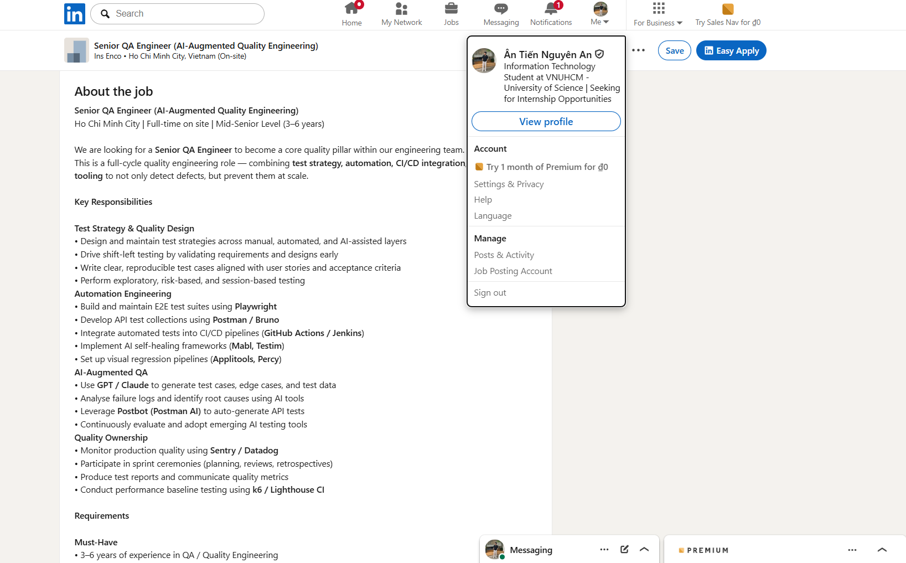
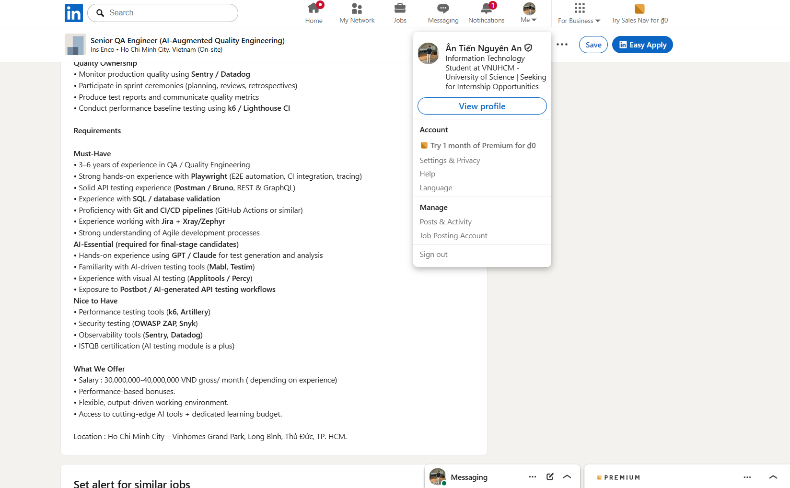

---

### Job 8 – Senior Automation Test Engineer (Test Lead)

- Công ty: KMS Technology, Inc., công ty có trụ sở tại Mỹ và văn phòng toàn cầu tại Việt Nam, Mexico, Poland
- Nền tảng: LinkedIn
- Link công việc: https://www.linkedin.com/jobs/view/4419660521/
- Ngày đăng: ~04/06/2026 (“2 days ago” tính đến ngày 06/06/2026)
- Ảnh chụp có ngày: 06/06/2026
- Địa điểm: Thành phố Hồ Chí Minh, Việt Nam (Hybrid, Full-time)
- Lương: Không công bố. Phúc lợi bao gồm annual performance bonus, premium healthcare cho employee + family, onsite assignments tại US/Canada/Europe
- Yêu cầu kỹ năng AI/LLM/automation-AI: YES

#### Mô tả công việc

- Thực hiện toàn bộ testing activities để cải thiện product quality, làm việc chặt chẽ với team như developers, business analysis, customer service, operation, v.v. nhằm đảm bảo product success
- Xử lý nhu cầu test automation một cách có phương pháp, chú trọng chi tiết, với sự hỗ trợ của kỹ năng phân tích và giải quyết vấn đề mạnh
- Tự động hóa functional, regression và/hoặc performance acceptance tests
- Chịu trách nhiệm đầy đủ trong việc nâng cao end-to-end automated test coverage
- Tham gia sprint planning và làm việc chặt chẽ với Scrum team để phân tích requirements và đưa ra test recommendations cần thiết

#### Kỹ năng yêu cầu

**Yêu cầu chung:**

- Trình độ tiếng Anh ít nhất ở mức intermediate.
- Khoảng hơn 4 năm kinh nghiệm tạo và chạy automated tests trên web/API
- Làm việc có phương pháp, chú trọng chi tiết, có kỹ năng phân tích và giải quyết vấn đề tốt
- Có sự tận tâm mạnh mẽ với chất lượng và thái độ kiểm thử tích cực, hợp tác
- Hiểu biết tốt về software development lifecycle (SDLC) và agile methodologies
- Có khả năng tự học và nhanh chóng thích nghi với công nghệ mới

**Yêu cầu kỹ thuật**

- Hiểu biết sâu về UI, API, mobile/desktop app testing
- Có kinh nghiệm testing vững chắc, bao gồm test strategy, test approach, test plan, test techniques như black box, risk-based, exploratory, Non-UI testing, v.v.
- Kinh nghiệm mạnh về Automation testing với các frameworks như Selenium/Katalon/Karate/Cucumber/Playwright, v.v.
- Thành thạo coding với Java/JavaScript/v.v.
- Có kinh nghiệm thực hành với test tools như Mocha / Chai / Jasmine / TestNG / Nightwatch / Protractor / v.v.
- Có kinh nghiệm CI/CD như Apache Airflow, GitLab, GitHub Action, Jenkins, v.v.

**Nice to have:**

- Kinh nghiệm Performance và Security testing
- Sử dụng AI coding tools hằng ngày một cách thành thạo, như Copilot, Cursor, Claude Code, trong toàn bộ SDLC
- Có khả năng phân rã các task phức tạp, cung cấp context hiệu quả và áp dụng chain-of-thought cùng multi-step prompting workflows
- Có kinh nghiệm với agentic workflows và AI-driven development frameworks
- Có kinh nghiệm thực hành tích hợp AI tools với các hệ thống khác thông qua MCP (Model Context Protocol) hoặc tương đương
- Có nhận thức về các AI tools mới nổi và sẵn sàng đánh giá, áp dụng các năng lực mới

#### Phân tích tác động của AI

Với vai trò Senior Automation Test Engineer/Test Lead, AI không thay thế nền tảng automation nhưng nâng kỳ vọng về năng suất thông qua Copilot, Cursor, Claude Code, prompting workflows và agentic workflows trong toàn bộ SDLC. Người QA lead vẫn cần năng lực phân rã yêu cầu, thiết kế test strategy, kiểm soát end-to-end automated coverage và đánh giá khi nào kết quả do AI hỗ trợ là đáng tin cậy.

#### Ảnh chụp màn hình

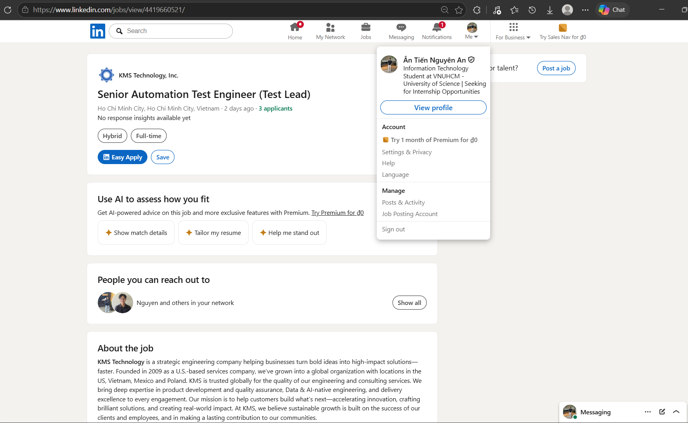
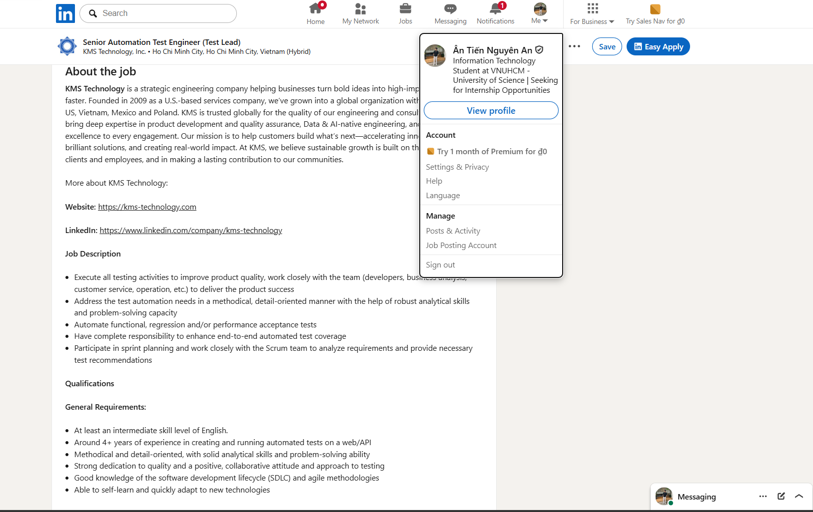
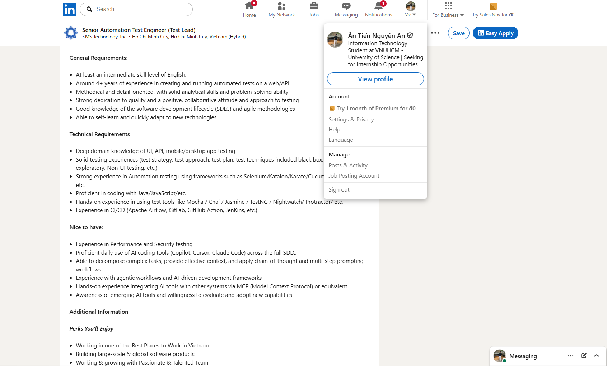
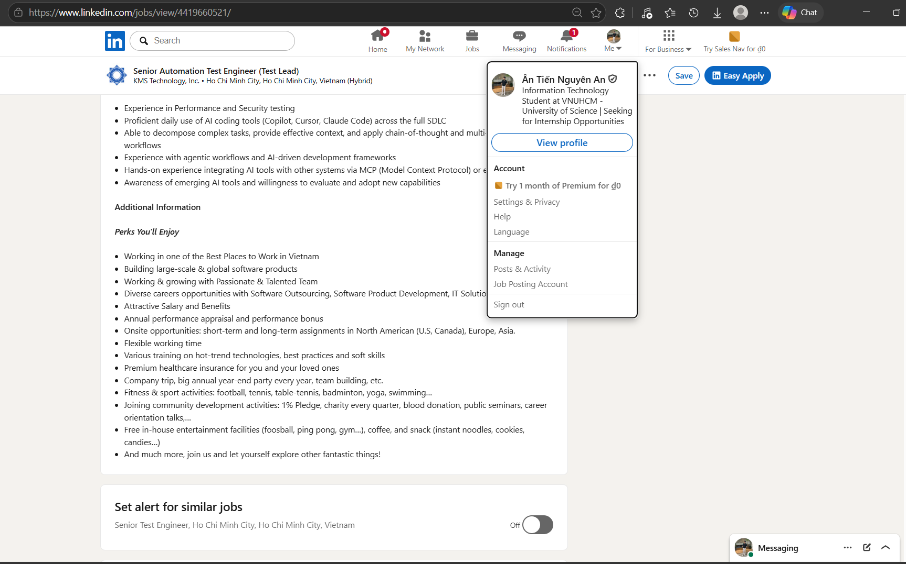

---

### Job 9 – Software Development Engineer in Test (AI-First)

- Công ty: OPSWAT
- Nền tảng: LinkedIn
- Link công việc: https://www.linkedin.com/jobs/view/4405677328
- Ngày đăng: ~30/05/2026 (“Reposted 1 week ago” tính đến ngày 06/06/2026)
- Ảnh chụp có ngày: 06/06/2026
- Địa điểm: Thành phố Hồ Chí Minh, Việt Nam (Full-time)
- Lương: Không công bố
- Yêu cầu kỹ năng AI/LLM/automation-AI: YES

#### Mô tả công việc

OPSWAT, công ty hàng đầu toàn cầu trong lĩnh vực IT, OT và ICS critical infrastructure cybersecurity, cung cấp một nền tảng end-to-end giúp các tổ chức công và tư nhân cũng như doanh nghiệp có lợi thế quan trọng trong việc bảo vệ các mạng lưới phức tạp, bảo mật thiết bị và đảm bảo tuân thủ. Trong hơn 20 năm, cam kết của công ty đối với công nghệ đổi mới đã tạo được sự tin cậy từ hơn 1.700 tổ chức, chính phủ và định chế trên toàn cầu, củng cố vai trò của OPSWAT trong việc bảo vệ critical infrastructure và đảm bảo an toàn cho cuộc sống hiện đại.

**Vị trí này**

Công ty đang tìm kiếm một Software Development Engineer in Test (SDET) có kỹ năng cao và tư duy hướng tương lai để tham gia OESIS Framework team. Vai trò này tập trung vào việc đảm bảo chất lượng, độ tin cậy và khả năng integration của OESIS trên nhiều môi trường khác nhau thông qua phương pháp automation-first và AI-driven testing.

Ứng viên sẽ thiết kế intelligent test systems, xác thực hành vi của OESIS ở cấp độ system và integration, đồng thời tận dụng AI/ML techniques để nâng cao hiệu quả và hiệu suất testing.

**Bạn sẽ làm gì:**

**Automation & OESIS Quality Engineering**

- Thiết kế, phát triển và duy trì scalable automated test frameworks để xác thực OESIS, ưu tiên Robot Framework và Python.
- Thúc đẩy automation-first testing strategy cho các OESIS components và integrations.
- Đảm bảo test coverage cao trên các mảng:
- Functional và regression testing
- API và integration testing
- System-level và compatibility testing
- Phân tích test results, xác định defects và làm việc chặt chẽ với developers để xử lý issues.

**AI-First Testing Innovation**

- Áp dụng AI/ML techniques để cải thiện test coverage, defect detection và test maintenance.
- Khám phá và triển khai:
- Intelligent test generation
- Self-healing automation
- Smart test selection và failure analysis
- Liên tục đánh giá các AI-driven testing tools và approaches mới.

**Shift-Left & Agile Collaboration**

- Hợp tác sớm với developers và product managers để cải thiện testability và xác định quality criteria.
- Đóng góp vào test strategy, design reviews và requirement analysis.
- Chủ động tham gia Agile/Scrum ceremonies và điều chỉnh testing phù hợp với sprint goals.

**OESIS & Integration Testing**

- Xác thực OESIS functionality trên nhiều operating systems, environments và third-party integrations khác nhau.
- Thực hiện API testing với RESTful services bằng tools như Postman hoặc custom scripts.
- Đảm bảo OESIS reliability, backward compatibility và tính dễ integration cho customers.

**CI Integration & Continuous Testing**

- Tích hợp automated tests vào CI pipelines, ví dụ Jenkins, GitHub Actions.
- Hỗ trợ continuous testing practices để đảm bảo feedback cycles nhanh và đáng tin cậy.

**Quality & Continuous Improvement**

- Điều tra và tái hiện các OESIS issues do customers báo cáo.
- Liên tục cải thiện automation frameworks, test coverage và QA processes.
- Thúc đẩy quality-first mindset trong team.

#### Kỹ năng yêu cầu

**Công ty cần gì từ bạn**

- Có kinh nghiệm thực tế ở vai trò QA Automation Engineer/SDET, tối thiểu 2 năm.
- Kinh nghiệm mạnh trong việc xây dựng hoặc duy trì automation frameworks, ưu tiên Robot Framework hoặc công cụ tương tự, tối thiểu 2 năm.
- Kỹ năng lập trình tốt với Python hoặc Java/Groovy, tối thiểu 2 năm.
- Hiểu rõ software testing methodologies như functional, regression, exploratory.
- Có kinh nghiệm thực hành API testing.
- Có kinh nghiệm với CI pipelines và version control như Git, tối thiểu 1 năm.
- Có kinh nghiệm làm việc trong môi trường Agile/Scrum.
- Kỹ năng phân tích và giải quyết vấn đề tốt, chú ý đến chi tiết.
- Kỹ năng giao tiếp tiếng Anh tốt là một lợi thế.

**AI-Focused Skills, ưu tiên cao**

- Hiểu các khái niệm AI/ML trong software testing.
- Có kinh nghiệm áp dụng AI tools để cải thiện testing efficiency hoặc coverage.
- Quan tâm đến việc xây dựng AI-driven QA practices.

**Sẽ là lợi thế nếu bạn có**

- Kinh nghiệm testing SDKs, libraries hoặc system-level software.
- Kiến thức về cross-platform testing trên Windows, Linux, macOS.
- Kinh nghiệm với performance hoặc reliability testing, ví dụ JMeter.
- Quen thuộc với debugging tools và logs cho low-level/system issues.
- Bằng cử nhân ngành Computer Science, Software Engineering hoặc lĩnh vực liên quan.

#### Phân tích tác động của AI

AI tác động trực tiếp đến SDET này vì job yêu cầu automation-first và AI-driven testing cho OESIS, bao gồm intelligent test generation, self-healing automation, smart test selection và failure analysis. Do sản phẩm liên quan đến cybersecurity và integration trên nhiều môi trường, kỹ năng AI phải đi kèm với Python/Robot Framework, API/system testing và khả năng con người phân tích lỗi, tương thích và rủi ro bảo mật.

#### Ảnh chụp màn hình

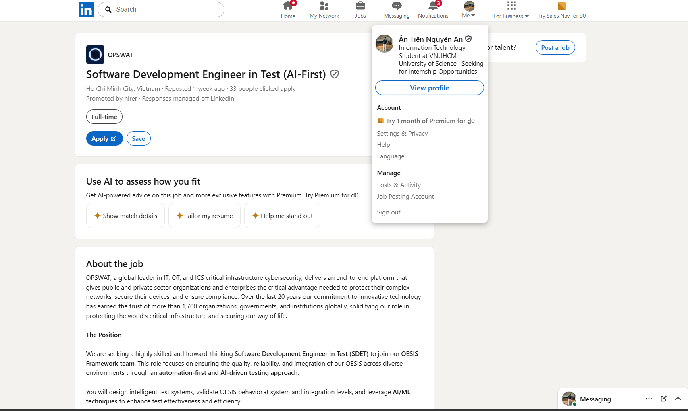
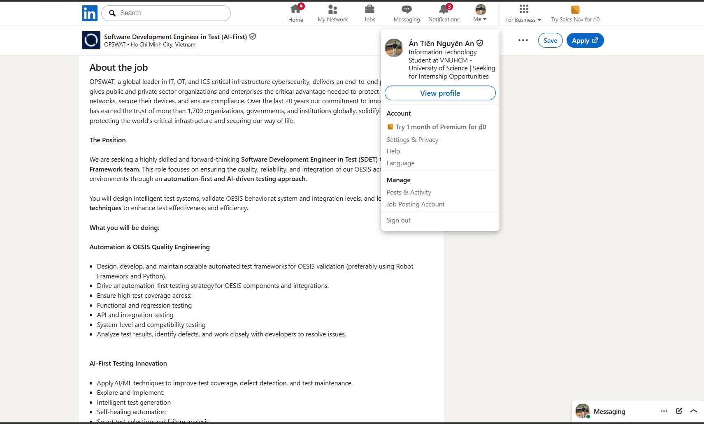
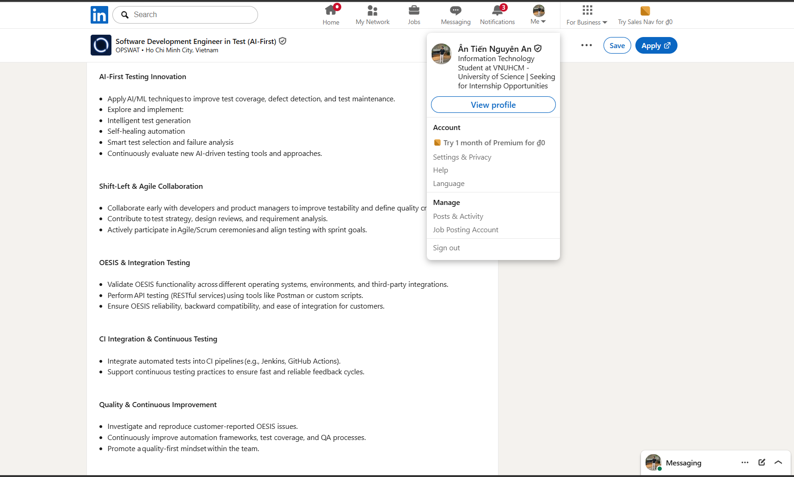
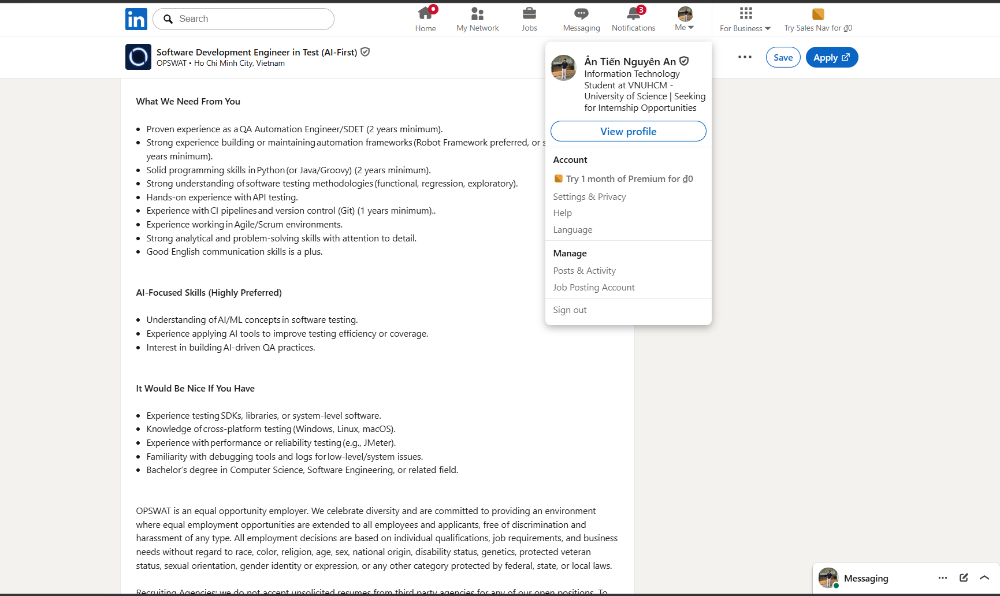

---

### Job 10 – QC Automation Engineer

- Công ty: Rainscales
- Nền tảng: LinkedIn
- Link công việc: https://www.linkedin.com/jobs/view/4418560816/
- Ngày đăng: ~30/05/2026 (“1 week ago” tính đến ngày 06/06/2026)
- Ảnh chụp có ngày: 06/06/2026
- Địa điểm: Thành phố Hồ Chí Minh, Việt Nam (On-site, Full-time)
- Lương: Không công bố
- Yêu cầu kỹ năng AI/LLM/automation-AI: YES

#### Mô tả công việc

- Automation: Thiết kế, phát triển và bảo trì automation test framework/script cho Web UI và API. Tối ưu execution time và nâng cao độ ổn định của test script;

- AI Automation Testing: Tham gia xây dựng và phát triển bộ khung cho AI Automation Testing, hỗ trợ mở rộng automation coverage cho các bài toán kiểm thử liên quan đến AI khi có yêu cầu;

- Manual: Thực hiện manual testing khi cần để nắm bắt business flow, validate tính năng và hỗ trợ tăng automation coverage;

- Quy trình: Phân tích tài liệu yêu cầu như SRS, PRD; thiết kế test scenario/test case, quản lý test data và tạo test report;

- Phối hợp: Tham gia review requirement, sprint planning; theo dõi kết quả test, phân tích lỗi và phối hợp với Developer để xử lý issue;

- Cải tiến: Đề xuất giải pháp tối ưu quy trình testing và hỗ trợ tích hợp automation test vào CI/CD pipeline khi có yêu cầu.

#### Kỹ năng yêu cầu

**YÊU CẦU BẮT BUỘC (MUST-HAVE SKILLS):**

- Tốt nghiệp Đại học trở lên ở các chuyên ngành liên quan đến công nghệ, phần mềm, kiểm thử,...;

- Kinh nghiệm: Từ 2-3 năm kinh nghiệm Automation Testing và ít nhất có 1 năm Manual Testing. Có kinh nghiệm xây dựng hoặc duy trì automation framework;

- Ngôn ngữ & Tool: Sử dụng tốt Python trong automation testing; biết JavaScript/TypeScript là lợi thế. Có kinh nghiệm với Selenium hoặc Playwright; ưu tiên ứng viên từng dùng Pytest hoặc Robot Framework;

- Kỹ năng kiểm thử:
  - API Testing: Postman, Requests, Playwright API hoặc công cụ/thư viện tương đương;

  - Database Testing: viết SQL query cơ bản để validate data.

- Tư duy & Kỹ năng mềm: Có khả năng phân tích requirement, làm việc độc lập, chủ động trong công việc, giao tiếp và phối hợp team hiệu quả. Đọc hiểu tài liệu kỹ thuật tiếng Anh ở mức cơ bản.

**YÊU CẦU ƯU TIÊN (NICE-TO-HAVE SKILLS):**

- Có kinh nghiệm Performance Testing với JMeter, k6, Locust, Gatling hoặc công cụ tương đương;

- Có kinh nghiệm setup automation test trong CI/CD pipeline như Jenkins, GitLab CI, GitHub Actions;

- Có kinh nghiệm sử dụng Git, Docker hoặc môi trường test containerized;

- Có kinh nghiệm review automation code hoặc xây dựng coding convention cho team;

- Có hiểu biết về test strategy, test pyramid, automation coverage và mô hình Agile/Scrum.

#### Phân tích tác động của AI

AI là một hướng mở rộng rõ ràng trong vị trí QC Automation Engineer vì ứng viên tham gia xây dựng framework cho AI Automation Testing và mở rộng automation coverage cho các bài toán kiểm thử liên quan đến AI. Tuy nhiên, nền tảng quan trọng vẫn là Python, Selenium/Playwright, API/database testing và khả năng manual testing để hiểu business flow trước khi tự động hóa hoặc áp dụng AI vào coverage.

#### Ảnh chụp màn hình

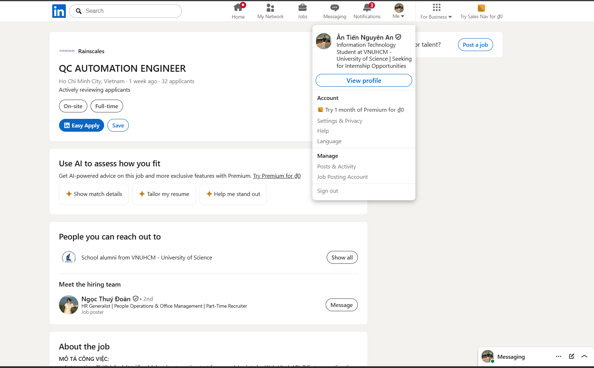
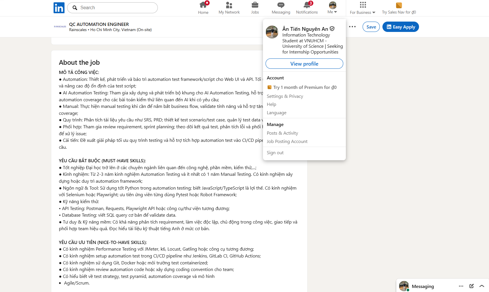

---

Tham khảo thêm artifact G9.1: [Mindmap vai trò QA/QC theo ISTQB và quy trình kiểm thử](qa_qc_role_mindmap.md).
