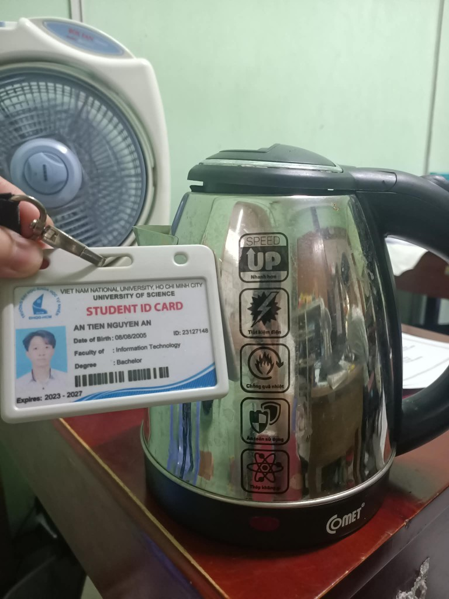
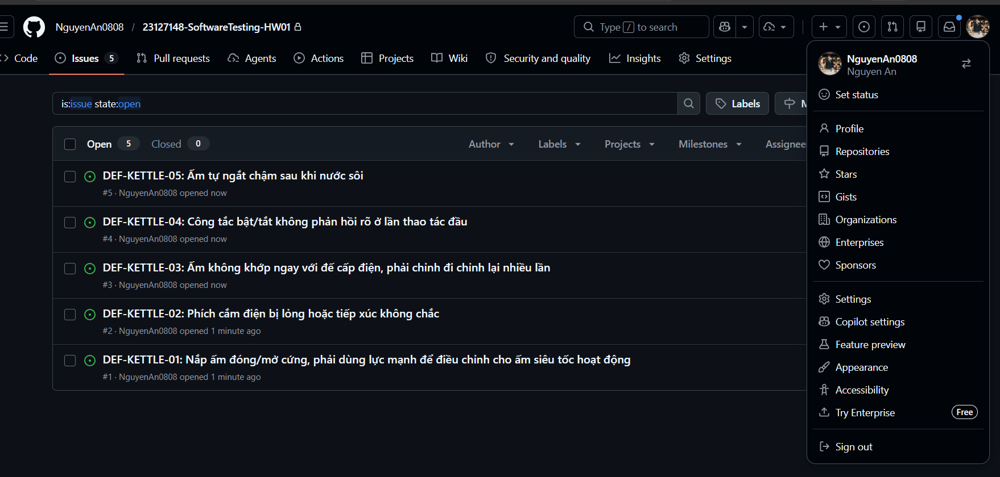
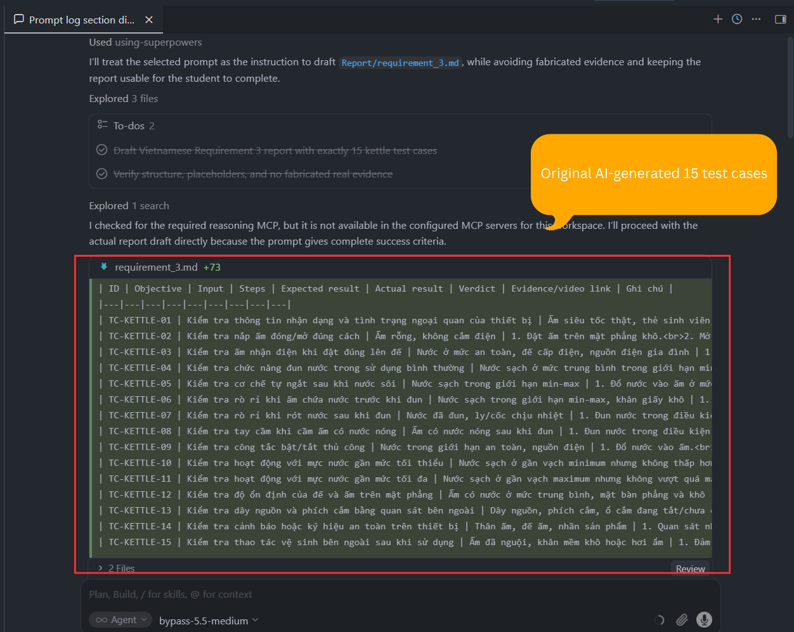
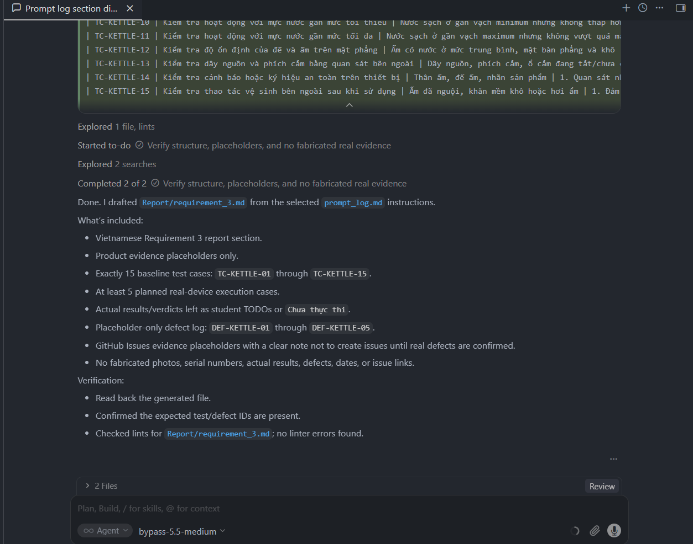

# Requirement 3 – Test Cases for One Physical Product

## 1. Thông tin thiết bị được kiểm thử

- Tên thiết bị: Ấm siêu tốc / Rapid boil kettle
- Brand: Comet
- Model: CM8215
- Year: 12/2024
- Serial number: 001H\*\*\*\*0201
- Ảnh thiết bị + thẻ sinh viên: 

Thiết bị được chọn là một ấm siêu tốc thật đang được sử dụng trong nhà sinh viên. Tất cả thông tin nhận dạng sản phẩm, ảnh chụp, video kiểm thử, kết quả thực tế và bằng chứng lỗi phải được sinh viên bổ sung sau khi kiểm tra thiết bị thật.

## 2. Phạm vi kiểm thử

Phạm vi kiểm thử tập trung vào các chức năng và đặc điểm có thể quan sát an toàn khi sử dụng ấm siêu tốc trong điều kiện gia đình bình thường, bao gồm: kiểm tra ngoại quan, nắp ấm, công tắc, đèn báo, khả năng đun nước, tự ngắt khi nước sôi, rò rỉ nước, dây nguồn, đế cấp điện, tay cầm, vòi rót và một số điều kiện biên cơ bản như mực nước thấp hoặc gần mức tối đa.

Các kiểm thử không bao gồm tháo rời thiết bị, can thiệp mạch điện, đo điện áp bên trong, làm hỏng linh kiện, thử nghiệm quá tải nguy hiểm, vận hành khi không có nước nếu nhà sản xuất không cho phép, hoặc bất kỳ thao tác nào có thể gây bỏng, điện giật, cháy nổ hoặc hư hỏng thiết bị.

## 3. Chiến lược thiết kế test cases

Bộ 15 test cases được thiết kế để bao phủ các nhóm rủi ro chính của ấm siêu tốc: sử dụng bình thường, an toàn khi vận hành, tính tiện dụng, điều kiện biên cơ bản và kiểm tra vật lý bên ngoài. Các test cases được viết ở mức baseline để sinh viên có thể thực thi trên thiết bị thật, ghi nhận actual result bằng bằng chứng video ngắn và chỉ tạo defect/GitHub Issue khi lỗi thật được xác nhận.

## 4. Danh sách 15 test cases

| ID           | Objective                                                           | Input                                                               | Steps                                                                                                                                                                                                                                                                                                                                                       | Expected result                                                                                                                                                                                                             | Actual result                                                                                                                                                    | Verdict | Evidence/video link                    | Ghi chú                                                     |
| ------------ | ------------------------------------------------------------------- | ------------------------------------------------------------------- | ----------------------------------------------------------------------------------------------------------------------------------------------------------------------------------------------------------------------------------------------------------------------------------------------------------------------------------------------------------- | --------------------------------------------------------------------------------------------------------------------------------------------------------------------------------------------------------------------------- | ---------------------------------------------------------------------------------------------------------------------------------------------------------------- | ------- | -------------------------------------- | ----------------------------------------------------------- |
| TC-KETTLE-01 | Kiểm tra ấm có thể đun nước bình thường với mực nước an toàn        | Nước sạch ở mức trung bình, nằm trong giới hạn MIN-MAX của ấm       | 1. Đặt đế ấm trên mặt phẳng khô ráo. 2. Đổ nước vào ấm ở mức trung bình, không thấp hơn MIN và không vượt MAX. 3. Đóng nắp ấm. 4. Đặt ấm đúng lên đế cấp điện. 5. Cắm điện và bật công tắc. 6. Quan sát quá trình đun cho đến khi nước sôi hoặc thiết bị tự ngắt.                                                                            | Ấm bắt đầu đun bình thường, nước nóng dần đến khi sôi, không rò nước, không có mùi khét, khói, tia lửa, tiếng động nguy hiểm hoặc dấu hiệu bất thường.                                                                      | Ấm bắt đầu đun bình thường, nước nóng dần và không có khói, mùi khét, tia lửa hoặc rò nước bất thường.                                                           | PASS    | Ghi nhận trong Test Cases artifact     | Đã thực thi; không phát hiện defect.                        |
| TC-KETTLE-02 | Kiểm tra nắp ấm đóng/mở đúng cách                                   | Ấm rỗng, không cắm điện                                             | 1. Đặt ấm trên mặt phẳng khô. 2. Mở nắp ấm. 3. Đóng nắp ấm lại. 4. Kiểm tra nắp có khít và không bị kẹt hay không.                                                                                                                                                                                                                                 | Nắp mở/đóng trơn tru, đóng khít, không bị lỏng bất thường hoặc kẹt cơ học.                                                                                                                                                  | Nắp ấm đóng/mở cứng hơn bình thường; khi đóng cần dùng lực hoặc chỉnh lại mới khít.                                                                              | FAIL    | https://youtube.com/shorts/Zn9EdM0ewUM | Defect: DEF-KETTLE-01.                                      |
| TC-KETTLE-03 | Kiểm tra ấm nhận điện khi đặt đúng lên đế                           | Nước ở mức an toàn, đế cấp điện, nguồn điện gia đình                | 1. Đổ nước vào ấm trong khoảng min-max. 2. Đặt ấm lên đế cấp điện. 3. Cắm điện. 4. Bật công tắc đun. 5. Quan sát đèn báo hoặc dấu hiệu thiết bị bắt đầu hoạt động.                                                                                                                                                                              | Khi đặt đúng lên đế và bật công tắc, ấm bắt đầu đun; đèn báo hoặc trạng thái hoạt động hiển thị rõ.                                                                                                                         | Khi đặt đúng lên đế và bật công tắc, ấm nhận điện và bắt đầu hoạt động; đèn báo hiển thị rõ.                                                                     | PASS    | Ghi nhận trong Test Cases artifact     | Đã thực thi; không phát hiện defect.                        |
| TC-KETTLE-04 | Kiểm tra hành vi khi nhấc ấm khỏi đế trong lúc đang đun             | Nước sạch ở mức an toàn trong giới hạn min-max, nguồn điện gia đình | 1. Đổ nước vào ấm trong giới hạn an toàn. 2. Đóng nắp và đặt ấm đúng lên đế. 3. Bật công tắc để ấm bắt đầu đun. 4. Khi ấm đang hoạt động ổn định, cầm vào tay cầm và nhấc ấm thẳng lên khỏi đế trong vài giây. 5. Đặt ấm lại đúng vị trí trên đế và quan sát trạng thái hoạt động.                                                              | Khi ấm bị nhấc khỏi đế, quá trình đun dừng ngay; không có tia lửa, tiếng nổ, mùi khét hoặc dấu hiệu tiếp xúc điện bất thường. Khi đặt lại đúng đế, ấm chỉ tiếp tục hoạt động theo thiết kế của công tắc và đế cấp điện.     | Khi nhấc ấm khỏi đế, quá trình đun dừng; không có tia lửa, mùi khét hoặc tiếng động nguy hiểm.                                                                   | PASS    | Ghi nhận trong Test Cases artifact     | AI-missed edge case; đã thực thi và không phát hiện defect. |
| TC-KETTLE-05 | Kiểm tra cơ chế tự ngắt sau khi nước sôi                            | Nước sạch trong giới hạn min-max                                    | 1. Đổ nước vào ấm ở mức an toàn. 2. Đóng nắp. 3. Bật công tắc đun. 4. Chờ đến khi nước sôi. 5. Quan sát công tắc và đèn báo sau khi nước sôi.                                                                                                                                                                                                   | Sau khi nước sôi, ấm tự ngắt; công tắc chuyển về trạng thái tắt hoặc đèn báo tắt theo thiết kế của thiết bị.                                                                                                                | Sau khi nước sôi, ấm tự ngắt chậm hơn kỳ vọng; thiết bị tiếp tục đun thêm một khoảng ngắn trước khi công tắc/đèn báo tắt.                                        | FAIL    | https://youtube.com/shorts/Zn9EdM0ewUM | Defect: DEF-KETTLE-05.                                      |
| TC-KETTLE-06 | Kiểm tra rò rỉ khi ấm chứa nước trước khi đun                       | Nước sạch trong giới hạn min-max, khăn giấy khô                     | 1. Đổ nước vào ấm trong giới hạn cho phép. 2. Đặt ấm lên khăn giấy khô trong 1-2 phút khi chưa cắm điện. 3. Quan sát quanh thân, đáy ấm và khăn giấy.                                                                                                                                                                                                 | Không có nước rò ra từ thân, đáy, nắp hoặc khu vực tiếp giáp với đế ấm.                                                                                                                                                     | Không quan sát thấy nước rò ra từ thân, đáy, nắp hoặc khu vực tiếp giáp với đế ấm.                                                                               | PASS    | Ghi nhận trong Test Cases artifact     | Đã thực thi; không phát hiện defect.                        |
| TC-KETTLE-07 | Kiểm tra rò rỉ khi rót nước sau khi đun                             | Nước đã đun, ly/cốc chịu nhiệt                                      | 1. Đun nước trong điều kiện bình thường. 2. Sau khi ấm tự ngắt, nhấc ấm khỏi đế. 3. Rót nước chậm vào ly/cốc chịu nhiệt. 4. Quan sát vòi rót, nắp và thân ấm.                                                                                                                                                                                      | Nước chảy ra từ vòi rót ổn định; không rò mạnh từ nắp, thân hoặc đáy ấm; người dùng có thể rót an toàn.                                                                                                                     | Nước rót ra từ vòi ổn định; không thấy rò mạnh từ nắp, thân hoặc đáy ấm trong quá trình rót.                                                                     | PASS    | Ghi nhận trong Test Cases artifact     | Đã thực thi; không phát hiện defect.                        |
| TC-KETTLE-08 | Kiểm tra tay cầm khi cầm ấm có nước nóng                            | Ấm có nước nóng sau khi đun                                         | 1. Đun nước trong điều kiện bình thường. 2. Sau khi ấm tự ngắt, chờ vài giây để hơi nước giảm. 3. Cầm ấm bằng tay cầm. 4. Không chạm vào thân kim loại/thân nóng của ấm. 5. Ghi nhận cảm giác an toàn khi cầm.                                                                                                                                  | Tay cầm chắc chắn, không lỏng, không quá nóng đến mức không thể cầm trong thao tác rót bình thường.                                                                                                                         | Tay cầm chắc chắn, có thể cầm trong thao tác bình thường; không ghi nhận nóng bất thường ở tay cầm.                                                              | PASS    | Ghi nhận trong Test Cases artifact     | Đã thực thi; không phát hiện defect.                        |
| TC-KETTLE-09 | Kiểm tra công tắc bật/tắt thủ công                                  | Nước trong giới hạn an toàn, nguồn điện                             | 1. Đổ nước vào ấm. 2. Đặt ấm lên đế và cắm điện. 3. Bật công tắc. 4. Sau vài giây, tắt công tắc thủ công nếu thiết kế cho phép. 5. Quan sát trạng thái hoạt động.                                                                                                                                                                               | Công tắc có thể bật/tắt rõ ràng; khi tắt thủ công, quá trình đun dừng và đèn báo tắt hoặc trạng thái hoạt động dừng theo thiết kế.                                                                                          | Công tắc không phản hồi rõ ở lần thao tác đầu; cần bật lại dứt khoát hơn mới chuyển sang trạng thái hoạt động.                                                   | FAIL    | https://youtube.com/shorts/Zn9EdM0ewUM | Defect: DEF-KETTLE-04.                                      |
| TC-KETTLE-10 | Kiểm tra hoạt động với mực nước gần mức tối thiểu                   | Nước sạch ở gần vạch minimum nhưng không thấp hơn minimum           | 1. Đổ nước gần mức minimum theo vạch trên ấm. 2. Đóng nắp. 3. Bật công tắc đun. 4. Quan sát quá trình đun và tự ngắt.                                                                                                                                                                                                                              | Ấm hoạt động bình thường với mực nước hợp lệ gần minimum và tự ngắt khi nước sôi.                                                                                                                                           | Ấm hoạt động bình thường với mực nước gần mức tối thiểu nhưng không thấp hơn MIN; không ghi nhận dấu hiệu bất thường.                                            | PASS    | Ghi nhận trong Test Cases artifact     | Đã thực thi; không phát hiện defect.                        |
| TC-KETTLE-11 | Kiểm tra hoạt động với mực nước gần mức tối đa                      | Nước sạch ở gần vạch maximum nhưng không vượt quá maximum           | 1. Đổ nước gần mức maximum nhưng không vượt vạch. 2. Đóng nắp. 3. Bật công tắc đun. 4. Quan sát khi nước nóng lên và khi tự ngắt.                                                                                                                                                                                                                  | Ấm đun bình thường; nước không trào ra ngoài trong quá trình đun nếu không vượt quá vạch maximum.                                                                                                                           | Ấm hoạt động bình thường với mực nước gần mức tối đa nhưng không vượt MAX; không quan sát thấy nước trào ra ngoài.                                               | PASS    | Ghi nhận trong Test Cases artifact     | Đã thực thi; không phát hiện defect.                        |
| TC-KETTLE-12 | Kiểm tra độ ổn định của đế và ấm trên mặt phẳng                     | Ấm có nước ở mức trung bình, mặt bàn phẳng và khô                   | 1. Đặt đế trên mặt bàn phẳng, khô. 2. Đặt ấm có nước lên đế. 3. Quan sát độ cân bằng. 4. Xoay nhẹ ấm theo phạm vi đặt bình thường nếu thiết kế cho phép.                                                                                                                                                                                           | Đế và ấm đứng ổn định, không nghiêng bất thường, không trượt dễ dàng trên mặt phẳng khô.                                                                                                                                    | Đế và ấm đứng ổn định trên mặt bàn khô; không ghi nhận nghiêng, trượt hoặc mất cân bằng bất thường.                                                              | PASS    | Ghi nhận trong Test Cases artifact     | Đã thực thi; không phát hiện defect.                        |
| TC-KETTLE-13 | Kiểm tra dây nguồn và phích cắm bằng quan sát bên ngoài             | Dây nguồn, phích cắm, ổ cắm đang tắt/chưa cắm                       | 1. Đảm bảo phích cắm chưa cắm điện. 2. Quan sát dây nguồn từ đầu phích đến đế. 3. Quan sát phích cắm và khu vực nối dây. 4. Ghi nhận dấu hiệu nứt, hở, cháy xém hoặc lỏng bất thường nếu có.                                                                                                                                                       | Dây nguồn và phích cắm không có hư hỏng ngoại quan nguy hiểm; không thấy lõi dây hở, cháy xém hoặc biến dạng nghiêm trọng.                                                                                                  | Phích cắm có dấu hiệu lỏng hoặc tiếp xúc không chắc; khi quan sát/thao tác bên ngoài có thể thấy kết nối không ổn định.                                          | FAIL    | https://youtube.com/shorts/Zn9EdM0ewUM | Defect: DEF-KETTLE-02.                                      |
| TC-KETTLE-14 | Kiểm tra ấm khi đặt lệch hoặc chưa khớp hoàn toàn với đế cấp điện   | Ấm có nước ở mức an toàn, đế cấp điện đặt trên mặt bàn khô          | 1. Đổ nước vào ấm trong giới hạn an toàn. 2. Đặt đế trên mặt phẳng khô và cắm điện. 3. Đặt ấm lên đế nhưng cố ý để lệch nhẹ, không ép mạnh và không làm ấm mất thăng bằng. 4. Thử bật công tắc nếu công tắc có thể thao tác bình thường. 5. Đặt lại ấm đúng khớp trên đế để so sánh trạng thái.                                                 | Khi ấm chưa khớp đúng với đế, thiết bị không được hoạt động bất thường; không có tia lửa, mùi khét, tiếng nổ hoặc trạng thái chập chờn nguy hiểm. Khi đặt đúng khớp, trạng thái hoạt động rõ ràng và ổn định theo thiết kế. | Ấm không khớp ngay với đế cấp điện; phải chỉnh vị trí nhiều lần mới đặt đúng và nhận điện ổn định.                                                               | FAIL    | https://youtube.com/shorts/Zn9EdM0ewUM | Defect: DEF-KETTLE-03; AI-missed edge case.                 |
| TC-KETTLE-15 | Kiểm tra hành vi đun lại khi nước còn nóng sau lần tự ngắt trước đó | Nước sạch đã được đun sôi và ấm vừa tự ngắt                         | 1. Thực hiện một lần đun nước bình thường trong giới hạn an toàn. 2. Sau khi ấm tự ngắt, để ấm đứng yên trên đế trong thời gian ngắn dưới sự quan sát của người dùng. 3. Khi nước vẫn còn nóng, thử bật lại công tắc nếu thiết kế của ấm cho phép. 4. Quan sát xem ấm có đun lại ngắn, từ chối bật lại, hoặc tự ngắt tiếp theo thiết kế hay không. | Ấm xử lý lần bật lại một cách kiểm soát: không đun kéo dài bất thường khi nước đã rất nóng, không bật/tắt chập chờn liên tục, không trào nước, không có mùi khét, khói hoặc tiếng động nguy hiểm.                           | Khi thử bật lại sau lần tự ngắt trước đó, ấm không có hiện tượng đun kéo dài bất thường, không bật/tắt chập chờn và không có mùi khét hoặc tiếng động nguy hiểm. | PASS    | Ghi nhận trong Test Cases artifact     | AI-missed edge case; đã thực thi và không phát hiện defect. |

## 5. Các test cases trong video

| Test case ID | Execution date | Evidence Video link                    | Actual result                                                                                                             | Verdict | Defect observed | Notes                                                                            |
| ------------ | -------------- | -------------------------------------- | ------------------------------------------------------------------------------------------------------------------------- | ------- | --------------- | -------------------------------------------------------------------------------- |
| TC-KETTLE-02 | 08/06/2026     | https://youtube.com/shorts/Zn9EdM0ewUM | Nắp ấm đóng/mở cứng hơn bình thường; khi đóng cần dùng lực hoặc chỉnh lại mới khít.                                       | FAIL    | DEF-KETTLE-01   | Kiểm tra nắp khi thiết bị chưa cắm điện.                                         |
| TC-KETTLE-13 | 08/06/2026     | https://youtube.com/shorts/Zn9EdM0ewUM | Phích cắm có dấu hiệu lỏng hoặc tiếp xúc không chắc; khi quan sát/thao tác bên ngoài có thể thấy kết nối không ổn định.   | FAIL    | DEF-KETTLE-02   | Chỉ quan sát bên ngoài, không tháo phích cắm hoặc đế.                            |
| TC-KETTLE-14 | 08/06/2026     | https://youtube.com/shorts/Zn9EdM0ewUM | Ấm không khớp ngay với đế cấp điện; phải chỉnh vị trí nhiều lần mới đặt đúng và nhận điện ổn định.                        | FAIL    | DEF-KETTLE-03   | Không nghiêng mạnh, không chạm tiếp điểm điện, không để nước tràn ra đế.         |
| TC-KETTLE-09 | 08/06/2026     | https://youtube.com/shorts/Zn9EdM0ewUM | Công tắc không phản hồi rõ ở lần thao tác đầu; cần bật lại dứt khoát hơn mới chuyển sang trạng thái hoạt động.            | FAIL    | DEF-KETTLE-04   | Không ép công tắc bằng lực mạnh; chỉ thao tác trong phạm vi sử dụng bình thường. |
| TC-KETTLE-05 | 08/06/2026     | https://youtube.com/shorts/Zn9EdM0ewUM | Sau khi nước sôi, ấm tự ngắt chậm hơn kỳ vọng; thiết bị tiếp tục đun thêm một khoảng ngắn trước khi công tắc/đèn báo tắt. | FAIL    | DEF-KETTLE-05   | Luôn quan sát trực tiếp trong lúc đun và rút điện sau khi ghi nhận hiện tượng.   |

## 6. Defect log từ thiết bị thật

Các defect dưới đây được ghi nhận từ 5 test cases quay video trong Mục 5. Mỗi defect được mô tả theo chênh lệch giữa expected result và actual result quan sát được.

| Defect ID     | Related test case | Mô tả defect nghi ngờ                                                                               | Bằng chứng thực tế                     | Mức độ ảnh hưởng                                                                            | Trạng thái         |
| ------------- | ----------------- | --------------------------------------------------------------------------------------------------- | -------------------------------------- | ------------------------------------------------------------------------------------------- | ------------------ |
| DEF-KETTLE-01 | TC-KETTLE-02      | Nắp ấm đóng/mở cứng hơn bất thường, có dấu hiệu bị kẹt hoặc không khớp mượt khi thao tác.           | https://youtube.com/shorts/Zn9EdM0ewUM | Medium – ảnh hưởng usability và có thể gây rủi ro khi người dùng thao tác với nước nóng.    | Confirmed in video |
| DEF-KETTLE-02 | TC-KETTLE-13      | Phích cắm điện bị lỏng hoặc tiếp xúc không chắc, dẫn tới nguy cơ cấp điện chập chờn khi đun nước.   | https://youtube.com/shorts/Zn9EdM0ewUM | High – liên quan an toàn điện và độ ổn định khi vận hành.                                   | Confirmed in video |
| DEF-KETTLE-03 | TC-KETTLE-14      | Ấm đặt lên đế không khớp ngay; người dùng phải chỉnh nhiều lần mới nhận điện ổn định.               | https://youtube.com/shorts/Zn9EdM0ewUM | Medium – ảnh hưởng khả năng sử dụng và có thể gây tiếp xúc điện không ổn định.              | Confirmed in video |
| DEF-KETTLE-04 | TC-KETTLE-09      | Công tắc bật/tắt không phản hồi rõ trong lần thao tác đầu, chỉ hoạt động khi bật lại dứt khoát hơn. | https://youtube.com/shorts/Zn9EdM0ewUM | Medium – ảnh hưởng thao tác điều khiển và khả năng nhận biết trạng thái hoạt động.          | Confirmed in video |
| DEF-KETTLE-05 | TC-KETTLE-05      | Ấm tự ngắt chậm sau khi nước sôi, tiếp tục đun thêm một khoảng ngắn trước khi dừng.                 | https://youtube.com/shorts/Zn9EdM0ewUM | High – liên quan an toàn nhiệt, tiêu thụ điện và nguy cơ quá nhiệt nếu không được giám sát. | Confirmed in video |

## 7. GitHub Issues evidence

- GitHub repository link: https://github.com/NguyenAn0808/23127148-SoftwareTesting-HW01
- Screenshot of GitHub Issues page showing student username: 
- GitHub Issue links for confirmed defects:
  - DEF-KETTLE-01: https://github.com/NguyenAn0808/23127148-SoftwareTesting-HW01/issues/1
  - DEF-KETTLE-02: https://github.com/NguyenAn0808/23127148-SoftwareTesting-HW01/issues/2
  - DEF-KETTLE-03: https://github.com/NguyenAn0808/23127148-SoftwareTesting-HW01/issues/3
  - DEF-KETTLE-04: https://github.com/NguyenAn0808/23127148-SoftwareTesting-HW01/issues/4
  - DEF-KETTLE-05: https://github.com/NguyenAn0808/23127148-SoftwareTesting-HW01/issues/5

GitHub Issues đã được tạo cho tất cả defect được xác nhận khi kiểm thử trên thiết bị thật. Ảnh chụp trang Issues hiển thị repository, danh sách issue và username GitHub của sinh viên.

## 8. AI-missed edge cases

- Hai ảnh chụp hội thoại AI dưới đây là minh chứng rằng baseline AI output không sinh ra ba edge cases thay thế này:

### 8.1 Edge case: nhấc ấm khỏi đế trong lúc đang đun

- Related test case ID: TC-KETTLE-04
- Người dùng có thể nhấc ấm không dây khỏi đế khi ấm đang đun, ví dụ muốn di chuyển ấm hoặc kiểm tra lượng nước. Trường hợp này kiểm tra phản ứng dừng cấp nhiệt và dấu hiệu bất thường tại điểm tiếp xúc giữa ấm và đế.
- AI baseline tập trung nhiều vào luồng sử dụng bình thường: đặt ấm đúng vị trí, bật công tắc, chờ nước sôi và kiểm tra tự ngắt. Vì vậy, AI chỉ xem quá trình đun như một chuỗi liên tục từ lúc bắt đầu đến lúc kết thúc, chứ chưa xét hành vi người dùng can thiệp giữa chừng. Trường hợp nhấc ấm khỏi đế khi đang đun là edge case vì rủi ro xảy ra tại thời điểm thiết bị đang hoạt động và kết nối điện qua đế bị ngắt đột ngột. Đây là tình huống thực tế với ấm không dây, nhưng dễ bị bỏ sót nếu chỉ thiết kế test theo happy path.

### 8.2 Edge case: ấm đặt lệch hoặc chưa khớp hoàn toàn với đế cấp điện

- Related test case ID: TC-KETTLE-14
- Người dùng có thể đặt ấm hơi lệch trên đế, đặc biệt khi thao tác nhanh hoặc đặt trong không gian bếp chật. Trường hợp này kiểm tra thiết bị có tránh hoạt động chập chờn hoặc bất thường khi tiếp xúc giữa ấm và đế chưa ổn định hay không.
- AI baseline đã có test đặt ấm đúng lên đế để kiểm tra thiết bị nhận điện, nhưng chưa xét trạng thái trung gian giữa “đặt đúng hoàn toàn” và “không đặt lên đế”. Với ấm siêu tốc không dây, trạng thái đặt lệch là điều kiện ngoại biên quan trọng vì tiếp xúc giữa ấm và đế có thể chưa ổn định. AI dễ bỏ qua trường hợp này vì nó thường giả định người dùng sẽ đặt thiết bị đúng cách trước khi bật, trong khi kiểm thử thực tế cần xét cả thao tác chưa chính xác nhưng vẫn có khả năng xảy ra trong sử dụng hằng ngày.

### 8.3 Edge case: bật đun lại khi nước vẫn còn nóng sau lần tự ngắt trước đó

- Related test case ID: TC-KETTLE-15
- Sau khi nước vừa sôi và ấm tự ngắt, người dùng có thể bật lại công tắc khi nước vẫn còn nóng để hâm lại hoặc do chưa nhận ra ấm đã đun xong. Trường hợp này kiểm tra hành vi đun lại ngắn, từ chối bật lại hoặc tự ngắt tiếp theo thiết kế.
- AI baseline có kiểm tra cơ chế tự ngắt sau khi nước sôi, nhưng chỉ dừng ở kết thúc của một chu kỳ đun đơn lẻ. Nó chưa xét chuỗi hành vi tiếp theo, khi người dùng bật lại ấm trong lúc nước vẫn còn nóng. Đây là edge case theo trạng thái trước đó của thiết bị: lần kiểm thử mới không bắt đầu từ nước nguội hoặc trạng thái ban đầu thông thường, mà bắt đầu từ trạng thái vừa tự ngắt. AI dễ bỏ sót vì mỗi test case trong baseline được viết khá độc lập, chưa phân tích mối liên hệ giữa hai lần sử dụng liên tiếp.
